## Redis

### Redis 的单线程与多线程

#### Redis 的单线程

##### Redis 的版本

Redis 的版本很多，版本不同架构也是不同的

- 版本 3.x ，最早版本，也就是大家口口相传的 redis 是单线程

- 版本 4.x，严格意义来说也不是单线程，而是负责处理客户端请求的线程是单线程，但是开始加了点多线程的东西(异步删除)

- 最新版本的 6.0.x 之后，告别了大家印象中的单线程，用一种全新的多线程来解决问题。

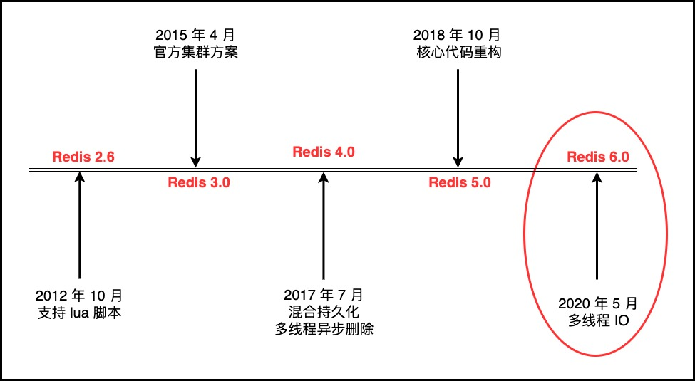

<br>

##### Redis 单线程的理解

**Redis 的单线程主要是是指 Redis 的网络 IO 和键值对读写是由一个线程来完成的**，Redis 在处理客户端的请求时包括获取 (socket 读)、解析、执行、内容返回 (socket 写) 等都由一个顺序串行的主线程处理，这就是所谓的 `单线程`。这也是 Redis 对外提供键值存储服务的主要流程。

Redis 的其它功能，比如持久化、异步删除、集群数据同步等等，其实是由额外的线程执行的。

**Redis 的工作线程是单线程的，但是Redis 的整体是多线程的。**

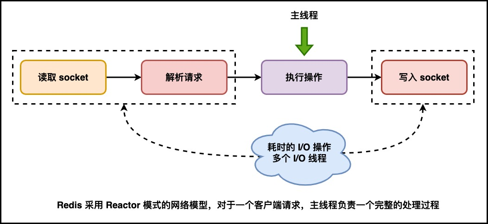

<br>

##### Redis 单线程高性能的原因

- 基于内存操作：Redis 的所有数据都存在内存中，因此所有的运算都是内存级别的，所以他的性能比较高；
- 数据结构简单：Redis 的数据结构是专门设计的，而这些简单的数据结构的查找和操作的时间大部分复杂度都是 O(1)，因此性能比较高；
- 多路复用和非阻塞 I/O：Redis使用 I/O 多路复用功能来监听多个 socket 连接的客户端，这样就可以使用一个线程连接来处理多个请求，减少线程切换带来的开销，同时也避免了 I/O 阻塞操作；
- 避免上下文切换：因为是单线程模型，因此就避免了不必要的上下文切换和多线程竞争，这就省去了多线程切换带来的时间和性能上的消耗，而且单线程不会导致死锁问题的发生。

> 官网关于 Redis 单线程高性能的解释：https://redis.io/topics/faq
>
> 他的大体意思是说 Redis 是基于内存操作的，因此他的瓶颈可能是机器的内存或者网络带宽而并非 CPU，既然 CPU 不是瓶颈，那么自然就采用单线程的解决方案了，况且使用多线程比较麻烦。但是在 Redis 4.0 中开始支持多线程了，例如后台删除等功能。
>
> 简单来说，Redis 4.0 之前一直采用单线程的主要原因有以下三个：
>
> 1. 使用单线程模型是 Redis 的开发和维护更简单，因为单线程模型方便开发和调试；
> 2. 即使使用单线程模型也能并发的处理多客户端的请求，主要使用的是多路复用和非阻塞 IO；
> 3. 对于 Redis 系统来说，主要的性能瓶颈是内存或者网络带宽，并非是 CPU。

<br>

##### Redis 单线程存在的问题

大 key 删除问题：

- 正常情况下使用 del 指令可以很快的删除数据，而当被删除的 key 是一个非常大的对象时，例如时包含了成千上万个元素的 hash 集合时，那么 del 指令就会造成 Redis **主线程卡顿**；
- 由于 redis 是单线程的，del bigKey，等待很久这个线程才会释放，类似加了一个 synchronized 锁。
- 这就是 redis3.x 单线程时代最经典的故障，大 key 删除的头疼问题。

<br>

##### 大 key 删除问题的解决方式

- 使用惰性删除可以有效的避免 Redis 卡顿的问题
- Redis 4.0 引入了多个线程来实现数据的异步惰性删除等功能，但是其处理读写请求的仍然只有一个线程，所以仍然算是狭义上的单线程。新增的多线程命令有如下几种：
  - unlink key
  - flushdb async
  - flushall async

> 比如当 Redis 需要删除一个很大的数据时，因为是单线程同步操作，这就会导致 Redis 服务卡顿，于是在 Redis 4.0 中就新增了多线程的模块，当然此版本中的多线程主要是为了解决删除数据效率比较低的问题的。例如把删除工作交给了后台的子线程来异步删除数据了。
>
> 因为 Redis 是单个主线程处理，redis 之父 antirez 一直强调 "Lazy Redis is better Redis"。而 lazy free 的本质就是把某些 cost(主要时间复杂度，占用主线程 cpu 时间片) 较高的删除操作，从 redis 主线程剥离，让子线程来处理，极大地减少主线阻塞时间。从而减少删除导致性能和稳定性问题。

<br>

#### Redis 的多线程

##### Unix 网络编程中的五种 IO 模型

- Blocking IO：阻塞 I/O
- NoneBlocking IO：非阻塞 I/O
- signal driven IO： 信号驱动 I/O
- asynchronous IO：异步 I/O
- IO multiplexing：I/O 多路复用

> I/O 多路复用是 I/O 模型的一种，即经典的 Reactor 设计模式，I/O 多路复用，简单来说就是通过监测文件的读写事件，再通知线程执行相关操作，保证 Redis 的非阻塞 I/O 能够顺利执行完成的机制。
>
> **多路**：指的是多个socket连接；
>
> **复用**：指的是复用一个线程。多路复用主要有三种技术：select，poll，epoll。epoll 是最新的也是目前最好的多路复用技术。采用多路 I/O 复用技术可以让单个线程高效的处理多个连接的请求（尽量减少网络 I/O 的时间消耗），且 Redis 在内存中操作数据的速度非常快（内存内的操作不会成为这里的性能瓶颈），主要以上两点造就了 Redis具有很高的吞吐量。

<br>

##### Redis 的I/O 多路复用

- I/O 的读和写本身是堵塞的，比如当 socket 中有数据时，Redis 会通过调用，先将数据从内核态空间拷贝到用户态空间，再交给 Redis 调用，而这个拷贝的过程就是阻塞的，当数据量越大时拷贝所需要的时间就越多，而这些操作都是基于单线程完成的。
- 在 Redis 6.0 中新增了多线程的功能来提高 I/O 的读写性能，他的主要实现思路是将主线程的  I/O  读写任务拆分给一组独立的线程去执行，这样就可以使多个 socket 的读写可以并行化了，采用多路 I/O 复用技术可以让单个线程高效的处理多个连接的请求（尽量减少网络 I/O 的时间消耗），将最耗时的 Socket 的读取、请求解析、写入单独外包出去，剩下的命令执行仍然由主线程串行执行并和内存的数据交互；
- 即 Redis 6.0 中，多个 I/O 线程解决网络 I/O 问题（多线程的红利），单个工作线程（主线程）保证线程安全（单线程的红利）。


<br>

##### Redis 多线程的开启

在 Redis6.0中，多线程机制默认是关闭的，如果需要使用多线程功能，需要在 redis.conf 中完成两个设置。

```xml
# 设置线程个数
io-threads 4
# 设置 io-thread-do-reads 配置项为 yes，表示启动多线程。
io-threads-do-reads yes
```

> 关于线程数的设置，官方的建议是如果为 4 核的 CPU，建议线程数设置为 2 或 3，如果为 8 核 CPU 建议线程数设置为 6，线程数一定要小于机器核数，线程数并不是越大越好。

---

### Redis 的数据类型

#### Redis 的几种数据类型

- string：字符串类型
- hash：散列类型
- list：列表类型
- set：集合类型
- zset：有序集合类型
- bitmap：位图类型
- hyperloglog：统计类型
- geo：地理类型

<br>

#### string：字符串类型

##### 常用命令

##### 命令不区分大小写，但 key 值区分大小写

```sh
# 存储
set key value
# 获取
get key
# 批量设置多个键值对
MSET key value [key value ....]
# 批量获取多个键的值
MGET key [key ....]
# 递增数字
INCR key
# 增加指定的整数
INCRBY key increment
# 递减数值
DECR key
# 减少指定的整数
DECRBY key decrement
# 获取字符串长度
STRLEN key
# 分布式锁（方式一）
setnx key value
# 分布式锁（方式二）；EX：key 过期时间（秒）；PX：过期时间（毫秒）；NX：当 key 不存时，才创建 key，等效于 setnx；XX：当 key 存在时，覆盖原有的 key 中的数据
set key value [EX seconds] [PX milliseconds] [NX|XX]
```

<br>

##### 应用场景

- 点赞某个商品或视频，点击一下加一次
- 统计文章的阅读数，点击地址，累计加一

<br>

#### hash：散列类型

##### 数据结构：`Map<String,Map<Object,Object>>`

##### 常用命令

```sh
# 一次设置一个字段值
HSET key field value
# 一次获取一个字段值
HGET key field
# 一次设置多个字段值
HMSET key field value [field value ...]
# 一次获取多个字段值
HMGET key field [field ....]
# 获取所有字段值
hgetall key
# 获取某个key内的全部数量
hlen key
# 删除一个key的一个元素
hdel key field
```

<br>

##### 应用场景

早期的购物车

```sh
# 新增商品
hset shopcar:uid1024 334488 1
# 增加商品数量
hincrby shopcar:uid1024 334488 1
# 统计商品总数
hlen shopcar:uid1024
# 全部选择
hgetall shopcar:uid1024
```


<br>

#### list：列表类型

list 是一个双端链表的结构，容量是 2 的 32 次方减 1 个元素，大概 40 多亿，主要功能有 push/pop 等，一般用在栈、队列、消息队列等场景。

##### 常用命令

```sh
# 向列表左边添加元素
LPUSH key value [value ...]
# 向列表右边添加元素
RPUSH key value [value ....]
# 查看列表
LRANGE key start stop
# 获取列表中元素的个数
LLEN key
```

<br>

##### 应用场景

###### 微信公众号订阅的消息

例如：大 V 作者李永乐老师和 CSDN 发布了文章分别是 11 和 22；colin 关注了他们两个，只要他们发布了新文章，就会安装进 colin 的订阅列表 List 中 

- 添加消息：`lpush likearticle:colin_id  11 22`

例如：查看 colin 自己订阅列表中的全部文章，类似分页，下面 0~10 就是一次显示 10 条

- 读取消息：`lrange likearticle:colin_id 0 9`

<br>

###### 商品评论列表

- 需求1：用户针对某一商品发布评论，一个商品会被不同的用户进行评论，保存商品评论时，要按时间顺序排序
- 需要2：用户在前端页面查询该商品的评论，需要按照时间顺序降序排序
- 使用 list 存储商品评论信息，key 是该商品的 id，value 是商品评论信息，例如商品编号为 1001 的商品评论的 key 是【items:comment:1001】
- `lpush items:comment:1001 {"id":1001,"name":"huawei","date":1600484283054,"content":"商品评论内容"}`

<br>

#### set：集合类型

##### 常用命令

```sh
# 添加元素
SADD key member [member ...]
# 删除元素
SREM key member [member ...]
# 遍历集合中的所有元素
SMEMBERS key
# 判断元素是否在集合中
SISMEMBER key member
# 获取集合中的元素总数
SCARD key
# 从集合中随机弹出一个元素，元素不删除
SRANDMEMBER key [数字]
# 从集合中随机弹出一个元素，出一个删一个
SPOP key [数字]
# 集合运算：设置 A 为 abc123；B 为 123ax
# 集合的差集运算 A-B，即属于A但不属于B的元素构成的集合
SDIFF key [key ...]
# 集合的交集运算 A∩B，即属于A同时也属于B的共同拥有的元素构成的集合
SINTER key [key ...]
# 集合的并集运算 A ∪ B，即属于A或者属于B的元素合并后的集合
SUNION key [key ...]
```

<br>

##### 应用场景

###### 微信抽奖小程序

- 根据用户ID，立即参与：`sadd key 用户ID`

- 显示已经有多少人参与了：`SCARD key`

- 抽奖（从 set 中任意选取 N 个中奖人）：

  - 随机抽奖2个人，元素不删除：`SRANDMEMBER key 2`

  - 随机抽奖3个人，元素会删除：`SPOP key 3`

<br>

###### 朋友圈点赞

- 新增点赞：`sadd pub:msgID 点赞用户ID1 点赞用户ID2`
- 取消点赞：`srem pub:msgID 点赞用户ID`
- 展现所有点赞过的用户：`SMEMBERS pub:msgID`
- 点赞用户数统计，就是常见的点赞红色数字：`scard pub:msgID`
- 判断某个朋友是否对楼主点赞过：`SISMEMBER pub:msgID 用户ID`

<br>

###### 微博好友关注社交关系

- colin 和 lee 两个人的关注数据：`sadd colin 郜林 郑智 梅西 小罗 温格`、`sadd lee 温格 小罗 内马尔 姆巴佩 哈兰德`

- colin 和 lee 共同关注的人（交集）：`SINTER colin lee`
- ~~colin 关注的人也关注他：`SISMEMBER colin 小罗  `、`SISMEMBER lee 小罗`~~

<br>

###### QQ内推可能认识的人

- colin 和 lee 两个人的关注数据：`sadd colin 郜林 郑智 梅西 小罗 温格`、`sadd lee 温格 小罗 内马尔 姆巴佩 哈兰德`
- lee 可能认识的人：`SDIFF colin lee`
- colin 可能认识的人：`SDIFF lee colin`

<br>

#### zset：有序集合类型

向有序集合中加入一个元素和该元素的分数

##### 常用命令

```sh
# 添加元素
ZADD key score member [score member ...]
# 按照元素分数从小到大的顺序，返回索引从start到stop之间的所有元素
ZRANGE key start stop [WITHSCORES]
# 获取元素的分数
ZSCORE key member
# 删除元素
ZREM key member [member ...]
# 获取指定分数范围的元素
ZRANGEBYSCORE key min max [WITHSCORES] [LIMIT offset count]
# 增加某个元素的分数
ZINCRBY key increment member
# 获取集合中元素的数量
ZCARD key
# 获得指定分数范围内的元素个数
ZCOUNT key min max
# 按照排名范围删除元素
ZREMRANGEBYRANK key start stop
# 获取元素的排名，从小到大
ZRANK key member
# # 获取元素的排名，从大到小
ZREVRANK key member
```

<br>

##### 应用场景

###### 根据商品销售对商品进行排序显示

思路：定义商品销售排行榜(sorted set集合)，key 为 goods:sellsort，分数为商品销售数量。

例如：

- 商品编号1001的销量是9，商品编号1002的销量是15：`zadd goods:sellsort 9 1001 15 1002`
- 有一个客户又买了2件商品1001，商品编号1001销量加2：`zincrby goods:sellsort 2 1001`
- 求商品销量前10名：`ZRANGE goods:sellsort 0 10 withscores`

<br>

###### 抖音热搜

- 点击视频：`ZINCRBY hotvcr:20200919 1 八佰`、`ZINCRBY hotvcr:20200919 15 八佰 2 花木兰`
- 展示当日排行前10条：`ZREVRANGE hotvcr:20200919 0 9 withscores`

<br>

#### 常见的四种统计

##### 聚合统计

- 统计多个集合元素的聚合结果，例如交、差、并等集合统计
- 交并差集和聚合函数的应用

##### 排序统计

- 抖音视频最新评论留言的场景，请你设计一个展现列表。考察你的数据结构和设计思路

- list：每个评价对应一个 List 集合，这个 List 包含了对这个视频的所有评论，而且会按照评论时间保存这些评论，每来一个新评论就用 LPUSH 命令把它插入 List 的队头。但是，如果在演示第二页前，又产生了一个新评论，此时第2页的评论不一样了。原因：List 是通过元素在 List 中的位置来排序的，当有一个新元素插入时，原先的元素在 List 中的位置都后移了一位，原来在第 1 位的元素现在排在了第 2 位，当 LRANGE 读取时，就会读到旧元素。

- zset：在⾯对需要展示最新列表、排行榜等场景时，如果数据更新频繁或者需要分页显示，建议使⽤ zset。

  ```sh
  # 准备数据
  ZADD items 10241024 v1 10241025 v2 10241026 v3
  # 按照存储顺序列出数据
  ZRANGE items 0 2
  # 按照存储倒序列出数据
  ZREVERANGE items 0 2
  ```

##### 二值统计

- 集合元素的取值就只有 0 和 1 两种。例如：在钉钉上班签到打卡的场景中，我们只用记录有签到(1)或没签到(0)。可以使用 bitmap

##### 基数统计

- 统计⼀个集合中不重复的元素个数。使用 hyperloglog

<br>

#### bitmap：位图

##### bitmap 是什么

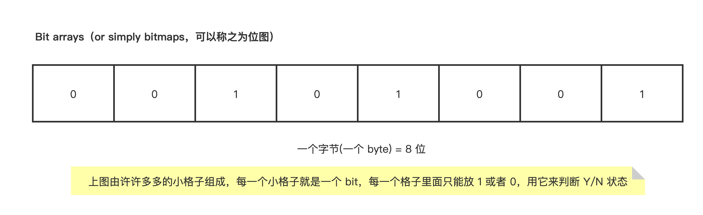

**用 string 类型作为底层数据结构实现的一种统计二值状态的数据类型**。由 0 和 1 状态表现的二进制位的 bit 数组。**位图本质是数组，它是基于 string 数据类型的按位的操作**。该数组由多个二进制位组成，每个二进制位都对应一个偏移量(我们可以称之为一个索引或者位格)。Bitmap 支持的最大位数是 2^32 位，它可以极大的节约存储空间，使用 512M 内存就可以存储多大 42.9 亿的字节信息(2^32 = 4294967296)。

<br>

##### 常用命令

```sh
# 设置 key 键在指定偏移量上的位(bit)。offset：偏移量，是从 0 开始计算的；value：位(bit)，只能是 0 或 1
setbit key offset value
# 获取 key 键在指定偏移量上的位(bit)。例如：setbit k1 4 1；getbit k1 4 → 1；getbit k1 3 → 0
getbit key offset
# 统计 key 键所存储的数据占用的字节数
strlen key
# 统计 key 键所存储的数据中，设置为 1 的位(bit)的数量。通过指定额外的 start 或 end 参数，可以让计数只在特定的位上进行
bitcount key [start] [end]
# 统计一个或多个 key 键所存储的数据的位元操作，并将结果保存到 destkey 上
# operation：可以是 AND、OR、NOT、XOR 这四种操作中的任意一种
# AND：求逻辑并；OR：求逻辑或；XOR：求逻辑异或；NOT：求逻辑非，
# 只有 NOT 仅能接收一个 key 作为输入；AND、OR、XOR 可以接收一个或多个 key 作为输入
bitop operation destkey key [key ...]
```

<br>

##### bitmap 的运用场景

- 用于统计状态：只有两种状态，Y 或者 N，类似 AtomicBoolean。
- 可以用于判断用户每日签到与否、电影广告是否被点击播放过、钉钉打卡、网站日活、连续打卡统计、最近一周的活跃用户、一年之中登录的天数等场景

<br>

##### 京东签到领取京豆案例：

需求说明：签到日历仅展示当月签到数据，签到日历需展示最近连续签到天数。

假设当前日期是 20210618，且 20210616 未签到，若 20210617 已签到，且 0618 未签到，则连续签到天数为 1，若 20210617 已签到且 0618 已签到，则连续签到天数为 2。

传统解决方案是使用 mysql 的方式来进行统计。当签到用户量较小时可以解决问题，但京东这个体量的用户量巨大（估算 3000W 签到用户，一天一条数据，一个月就是9亿数据）

对于京东这样的体量，如果一条签到记录对应着当日用户记录，那会很恐怖......

需解决思路：

- 一条签到记录对应一条记录，会占据越来越大的空间
- 一个月最多 31 天，int 类型刚好是 32 位，一个 int 类型就可以搞定一个月，32 位大于 31 天，当天来了标记为 1，没来标记为 0；
- 一条数据直接存储一个月的签到记录，不再是存储一天的签到记录

使用 Redis 的 bitmap 实现签到日历需求。在签到统计时，每个用户一天的签到用 1 个 bit 位就能表示，一个月的签到情况用 31 个 bit 位就能表示，一年的签到也只需要 365 个 bit 位表示，不需要太复杂的集合类型。

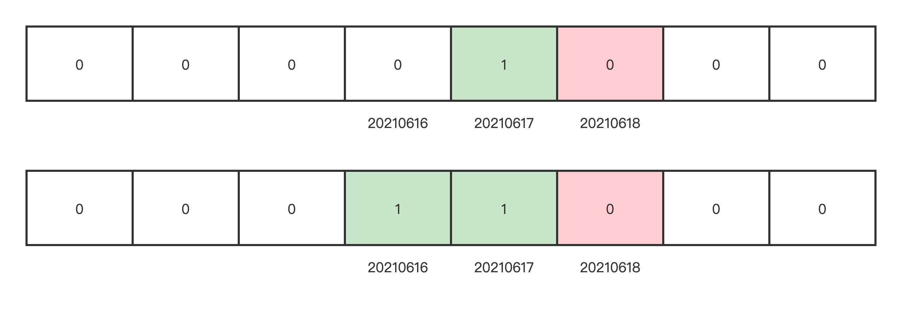

```sh
# colin 一周内签到的数据
SETBIT colin 1 1
SETBIT colin 2 1
SETBIT colin 3 1
SETBIT colin 5 1

# jeck 一周内签到的数据
SETBIT jeck 1 1
SETBIT jeck 3 1

# colin 在一周内一共签到的天数：结果为 4
BITCOUNT colin
# jeck 在一周内一共签到的天数：结果为 2
BITCOUNT jeck

# colin 和 jeck 在一周内同一天同时签到的总天数
BITOP and temp colin jeck
# 结果为 2
BITCOUNT temp
```

<br>

#### HyperLogLog：统计

Redis 在 2.8.9 版本中添加了 HyperLogLog 数据结构。Redis HyperLogLog 是用来做**基数**统计的算法，**HyperLogLog 的优点是，在输入元素的数量或体积非常非常大时，计算基数所需要的空间总是固定的、并且很小的。**

在 Redis 中，每个 HyperLogLog 键只需要花费 12KB 的内存空间，就可以计算接近 2^64 个不同元素的基数。这和计算基数时，元素越多越耗费内存空间的集合形成鲜明的对比。但是，因为 HyperLogLog 只会根据输入的元素来计算基数，而不会存储输入的元素本身，所以 HyperLogLog 不能像集合那样，返回输入的各个元素。

> 基数：是一种数据集，去重复后的元素的真实**个数**。例如：集合 = {2,4,6,8,77,39,4,8,10}，去掉重复的内容后，基数 = {2,4,6,8,77,39,10} = 7 个。
>
> 基数统计：用于统计一个集合中不重复的元素个数，就是对集合去重复后剩余元素的计算。即去重后的真实数据。

<br>

几个名词：

- UV：Unique Visitor，独立访客，一般理解为客户端 IP
- PV：Page View，页面浏览量，不用去重。
- DAU：Daily Active User，日活跃用户量。登录或者使用了某个产品的用户数量，需要去除重复登录的用户。常用于反映网站、互联网应用或者网络游戏的运营情况。
- MAU：Monthly Active User，月活跃用户量

<br>

使用 HyperLogLog 来解决以下几个需求

- 统计某个网站的 UV、统计某个文章的 UV
- 用户搜索网站关键词的数量
- 统计用户每天搜索不同词条个数

<br>

HyperLogLog 的原理说明：

- 只是进行不重复的基数统计，不是集合，也不保存数据，只记录数量，而不是具体内容
- 存在误差，是非精确统计，但误差仅仅只是 0.81% 左右，属于是牺牲准确率来换取空间。Redis 作者对于误差的说明：http://antirez.com/news/75

> 由此引出经典面试题：为什么redis集群的最大槽数是16384个？
>
> Redis 集群并没有使用一致性 hash，而是引入了**哈希槽**的概念。Redis 集群有 16384 个哈希槽，每个 key 通过 CRC16 校验后对 16384 **取模**来决定放置哪个槽，集群的每个节点负责一部分 hash 槽。但为什么哈希槽的数量是 16384（2^14）个呢？
>
> CRC16 算法产生的 hash 值有16bit，该算法可以产生 2^16=65536 个值。换句话说值是分布在 0~65535 之间。那作者在做 mod **取模**运算的时候，为什么不 mod 65536，而选择 mod16384？
>
> 官方说明：https://github.com/redis/redis/issues/2576
>
> - 普通心跳数据包携带节点的完整配置，可以用旧配置以幂等方式替换，以更新旧配置。这意味着它们包含原始形式的节点的插槽配置，该节点使用 16384 个插槽所占用的空间为 2k，而 65536 个插槽的空间就达到了 8k，因此不使用 65536 个插槽的方式。
> - 同时，由于其他的设计折衷，Redis 集群不太可能扩展到超过 1000个 主节点。
> - 因此 16k 处于正确的范围内，以确保每个主机具有足够的插槽，最多可容纳 1000 个矩阵，但数量足够少，可以轻松地将插槽配置作为原始位图传播。请注意，在小型群集中，位图将难以压缩，因为当 N 较小时，位图将设置的 slot/N 位，占设置位的百分比很大。
>
> 可以理解为：
>
> - 如果槽位为 65536，发送心跳信息的消息头达 8k，**发送的心跳包过于庞大**。在消息头中最占空间的是 myslots[CLUSTER_SLOTS/8]。 当槽位为 65536 时，这块的大小是: 65536÷8÷1024=8kb。因为每秒钟，redis 节点需要发送一定数量的 ping 消息作为心跳包，如果槽位为 65536，这个 ping 消息的消息头太大了，浪费带宽。
> - redis 的集群主节点数量基本不可能超过 1000个。集群节点越多，心跳包的消息体内携带的数据越多。如果节点过 1000个，也会导致网络拥堵。因此 redis 作者不建议redis cluster 节点数量超过 1000个。 那么，对于节点数在 1000 以内的 redis cluster 集群，16384 个槽位够用了。没有必要拓展到 65536 个。
> - 槽位越小，节点越少的情况下，压缩比高，容易传输。Redis 主节点的配置信息中，它所负责的哈希槽是通过一张 bitmap 的形式来保存的，在传输过程中会对 bitmap 进行压缩，但是如果 bitmap 的填充率 slots/N 很高的话(N 表示节点数)，bitmap 的压缩率就很低。 即节点数很少，而哈希槽数量很多的话，bitmap 的压缩率就很低。 

<br>

##### 常用命令

```sh
# 将所有元素添加到 key 中
pfadd key element ……
# 统计 key 的估算值（不精确）
pfcount key
# 合并 key 至新 key
pgmerge new_key key1 key2 ……
```

命令测试

```sh
# 准备数据
PFADD colin 1 3 5 7 9
PFADD jeck 2 4 4 4 6 8 9

# 统计 colin 中的基数：结果为 5
PFCOUNT colin
# 统计 jeck 中的基数：结果为 5
PFCOUNT jeck

# 将 colin、jeck 中的数据合并至 temp 中
PFMERGE temp colin jeck
# 统计 temp 中的基数：结果为 9
PFCOUNT temp
```

<br>

使用案例

天猫网站首页亿级 UV 的 Redis 统计方案

需求说明：UV 的统计需要去重，一个用户一天内的多次访问只能算作一次。淘宝、天猫首页的 UV，平均每天是 1~1.5 亿左右。每天存 1.5 亿的 IP，访问者来了后先去查是否存在，不存在加入。

<br>

#### GEO：地理

Redis 在 3.2 版本以后增加了地理位置的处理。

<br>

##### 常用命令

```sh
# 添加地理位置的坐标。longitude：经度；latitude：维度；member：位置名称
GEOADD key longitude latitude member [longitude latitude member ...]

# 获取地理位置的坐标
GEOPOS key member [member ...]

# 计算两个位置之间的距离。可设定单位
GEODIST key member1 member2 [m|km|ft|mi]

# 根据用户给定的经纬度坐标来获取指定范围内的地理位置集合。以半径为中心来查找数据。
# radius：半径；WITHDIST：在返回位置元素的同时，将位置元素与中心之间的距离也一并返回；WITHCOORD：将位置元素的经度和维度也一并返回；
# WITHHASH：以 52 位有符号整数的形式，返回位置元素经过原始 geohash 编码的有序集合分值。这个选项主要用于底层应用或者调试，实际中的作用并不大；
# COUNT：限定返回的记录数；ASC：查找结果根据距离从近到远排序；DESC：查找结果根据从远到近排序。
GEORADIUS key longitude latitude radius m|km|ft|mi [WITHCOORD] [WITHDIST] [WITHHASH] [COUNT count] [ASC|DESC] [STORE key] [STOREDIST key]

# 根据储存在位置集合里面的某个地点获取指定范围内的地理位置集合
GEORADIUSBYMEMBER key member radius m|km|ft|mi [WITHCOORD] [WITHDIST] [WITHHASH] [COUNT count] [ASC|DESC] [STORE key] [STOREDIST key]

# 返回一个或多个位置对象的 geohash 值
GEOHASH key member [member ...]
```

---

### Redis 数据类型的底层实现

#### 字典数据库

Redis 是 key-value 存储系统，其中 key 类型一般为字符串，value 类型则为 Redis 对象（redisObject）。

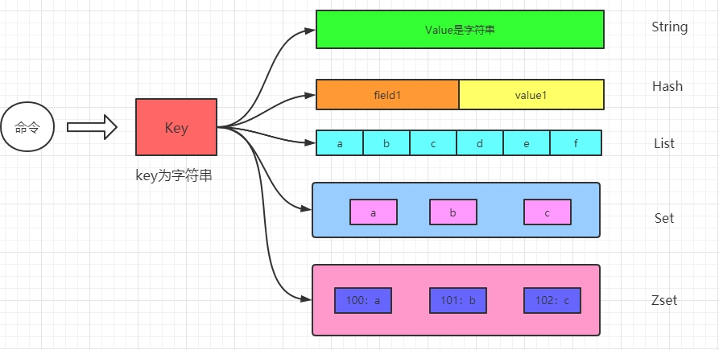

<br>

#### Redis 数据类型的实质

- bitmap：实质是 string
- hyperloglog：实质是 string
- GEO：实质是 zset

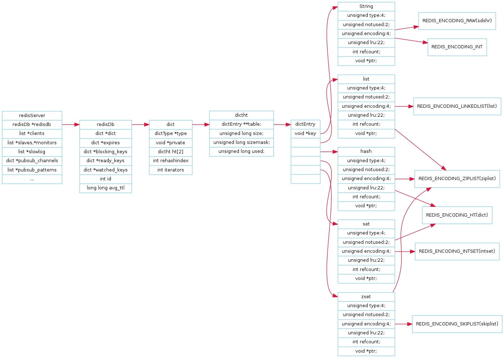

<br>

#### redisObject

##### C 语言 struct 结构体语法简介

定义**结构**：struct 语句定义了一个包含多个成员的新的数据类型，struct 语句的格式如下：

```c
struct type_name {
  memeber_type1 memeber_name1;
  memeber_type2 memeber_name2;
  memeber_type3 memeber_name3;
  ·
  ·
} object_names;
```

> `type_name` 是结构体类型的名称，`memeber_type1 memeber_name1` 是标准的变量定义，比如：`init i`；或者`float f`；或者其它有效的变量定义。在结构定义的末尾，最后一个分号之前，可以指定一个或多个结构变量，这是可选的，下面声明一个结构体类型 Books， 变量为 book；

```c
struct Books{
  char title[50];
  char author[50];
  char subject[100];
  int book_id;
} book;
```

##### typedef 关键字

下面是一种更简单的定义结构的方式，可以为创建的类型取一个”别名“，例如：

```c
typedef struct Books{
  char title[50];
  char author[50];
  char subject[100];
  int book_id;
} Books;
```

可以直接使用 Books 来定义 Books 类型的变量，而不需要使用 struct 关键字，如下：

```c
Books Book1，Book2；
```

##### Redis 源文件

##### 每个键值对都会有一个 dictEntry，例如源文件中字典 dict.h 的源码

```c
# dict.h 文件源码
typedef struct dictEntry {
    void *key;
    union {
        void *val;
        uint64_t u64;
        int64_t s64;
        double d;
    } v;
    struct dictEntry *next;
} dictEntry;
```

##### redis 中每个对象都是一个 redisObject 结构，例如源文件中 server.h 的源码

```c
typedef struct redisObject {
    unsigned type:4; /*当前对象的数据类型，包括 OBJ_STRING、OBJ_LIST、OBJ_HASH、OBJ_SET、OBJ_ZSET*/
    unsigned encoding:4; /*当前对象底层存储的编码类型，即具体的数据结构*/
    unsigned lru:LRU_BITS; /*采用 LRU 算法清除内存中的对象*/
    int refcount; /*引用计数，当 refcount 为 0 的时候，表示该对象已经不被任何对象引用，则可进行垃圾回收了*/
    void *ptr; /*指向对象实际的数据结构的指针*/
} robj;
```

> Redis 采用 redisObjec 结构来统一五种不同的数据类型，这样所有的数据类型就都可以以相同的形式在函数间传递，而不用使用特定的类型结构。同时，为了识别不同的数据类型，redisObjec 中定义了 type 和 encoding 字段，对不同的数据类型加以区别。简单地说，redisObject 就是 string、hash、list、set、zset 的父类，可以在函数间传递时隐藏具体的类型信息，所以作者抽象了 redisObjec 结构来到达同样的目的。
>
> -  4 位的 type 表示具体的数据类型，包括 OBJ_STRING、OBJ_LIST、OBJ_HASH、OBJ_SET、OBJ_ZSET
>
> - 4 位的 encoding 表示该类型的物理编码方式，**同一种数据类型可能有不同的编码方式**，比如 string 提供了三种，int、embstr、raw
> - lru 字段表示当内存超限时，采用 LRU 算法清除内存中的对象
> - refcount 表示对象的引用计数
> - ptr指针指向真正的底层数据结构的指针。

##### redisObject与底层数据结构之间的关系

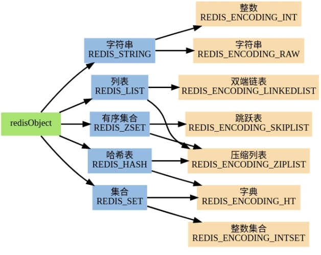

<br>

#### Redis 数据类型底层结构源码分析

以 `set hello word` 为例，Redis 是 k-v 键值对的数据库，每个键值对都会有一个 dictEntry（源码位置：dict.h），里面指向了 key 和 value 的指针，next 指向下一个 dictEntry。

key 是字符串，Redis 没有直接使用 C 语言中的字符数组，而是存储在 redis 自定义的 SDS 中。

value 既不是直接作为字符串存储，也不是直接存储在 SDS 中，而是存储在 redisObject 中。

实际上五种常用的数据类型的任何一种，都是通过 redisObject 来存储的。

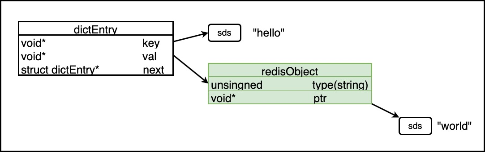


<br>

#### 数据类型与数据结构之间的关系

##### String

###### string 类型的三大编码格式

- int：保存 long 型（长整型）的 64 位（8 个字节）有符号整数；

  > long 数据类型是 64 位、有符号的以二进制补码表示的整数，这种类型主要使用在比较大整数的系统上，默认值是 0L
  >
  > 最小值是：-9,223,372,0936,854,775,808(-2^63)
  >
  > 最大值是：9,223,372,036,854,775,807(2^63 -1)
  >
  > 上面数字最多19位
  >
  > 只有整数才会使用 int，如果是浮点数， Redis 内部其实先将浮点数转化为字符串值，然后再保存

- embstr：EMBSTR 顾名思义即：embedded string，表示嵌入式的 String。代表 embstr 格式的 SDS（Simple Dynamic String 简单动态字符串），保存长度小于 44 个字节的字符串；

- raw：保存长度大于44字节的字符串。

###### string 类型的三大编码案例

```sh
# 普通数字
localhost:1>SET k1 123
"OK"
localhost:1>OBJECT encoding k1
"int"

# 长度小于 20 的数
localhost:1>SET k1 123456789123456789
"OK"
localhost:1>OBJECT encoding k1
"int"
# 长度大于等于 20 的数
localhost:1>SET k1 12345678912345678911
"OK"
localhost:1>OBJECT encoding k1
"embstr"

# 普通字符串
localhost:1>SET k1 abc
"OK"
localhost:1>OBJECT encoding k1
"embstr"
# 长度小于 44 的字符串
localhost:1>SET k1 aaaaaaaaaaaaaaaaaaaaaaaaaaaaaaaaaaaaaaaa
"OK"
localhost:1>OBJECT encoding k1
"embstr"
# 长度超过 44 的字符串
localhost:1>SET k1 aaaaaaaaaaaaaaaaaaaaaaaaaaaaaaaaaaaaaaaaaaaaa
"OK"
localhost:1>OBJECT encoding k1
"raw"
```

###### SDS

Redis 没有直接复用 C 语言的字符数组，而是新建了属于自己的结构，SDS。在 Redis 数据库里，包含字符串值的键值对都是由 SDS 实现的。Redis 中所有的键都是由字符串对象实现的，即底层是由 SDS 实现，Redis 中所有的值对象中包含的字符串对象底层也是由 SDS 实现。

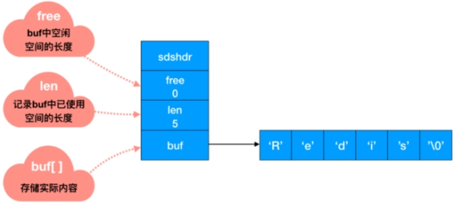

```h
# sds.h 源码
struct __attribute__ ((__packed__)) sdshdr8 {
    uint8_t len; /* 当前字符数组的长度，使我们在获取字符串长度的时候可以在 O(1)情况下拿到，而不是像 C 那样需要遍历一遍字符串 */
    uint8_t alloc; /* 当前字符数组总共分配的内存大小 */
    unsigned char flags; /* 当前字符数组的属性，用来表示到底是 sdshdr8 还是 sdshdr16 等 */
    char buf[]; /* 表示字符串数组，字符串真正的值 */
};
```

Redis 中字符串的实现，SDS有多种结构：

- sdshdr5：2^5=32 byte
- sdshdr8：2 ^ 8=256 byte
- sdshdr16：2 ^ 16=65536 byte = 64 KB
- sdshdr32：2 ^ 32 byte = 4 GB
- sdshdr64：2^64 byte  ＝17179869184G，用于存储不同的长度的字符串。

Redis 为什么重新设计一个 SDS 数据结构？

C 语言没有 Java 里面的 String 类型，只能是靠自己的 char[] 来实现，字符串在 C 语言中的存储方式，想要获取 Redis 的长度，需要从头开始遍历，直到遇到 `\0` 为止。所以，Redis 没有直接使用 C 语言传统的字符串标识，而是自己构建了一种名为简单动态字符串 SDS（simple dynamic string）的抽象类型，并将 SDS 作为 Redis 的默认字符串。

<table>
  <tr align="center">
  	<td>-</td>
    <td>C 语言</td>
    <td>SDS</td>
  </tr>
  <tr>
  	<td>字符串长度处理</td>
    <td>需要从头开始遍历，直到遇到 '\0' 为止，时间复杂度 O(N)</td>
    <td>记录当前字符串的长度，直接读取即可，时间复杂度 O(1)</td>
  </tr>
  <tr>
  	<td  rowspan="2">内存重新分配</td>
    <td  rowspan="2">分配内存空间超过后，会导致数组下标越级或者内存分配溢出</td>
    <td>空间预分配：SDS 修改后，len 长度小于 1M，那么将会额外分配与 len 相同长度的未使用空间。如果修改后长度大于 1M，那么将分配1M的使用空间。</td>
    </tr>
  <tr>
    <td>惰性空间释放：SDS 缩短时并不会回收多余的内存空间，而是使用 free 字段将多出来的空间记录下来。如果后续有变更操作，直接使用 free 中记录的空间，减少了内存的分配。</td>
  </tr>
  <tr>
  	<td>二进制安全</td>
    <td>二进制数据并不是规则的字符串格式，可能会包含一些特殊的字符，比如 '\0' 等。前面提到过，C 语言中字符串遇到 '\0' 会结束，那 '\0' 之后的数据就读取不上了</td>
    <td>根据 len 长度来判断字符串结束的，二进制安全的问题就解决了</td>
  </tr>
</table>

<br>

###### set key value 源码

**INT 编码格式：**

当字符串键值的内容可以用一个 64 位有符号整形来表示时，Redis 会将键值转化为 long 型来进行存储，此时即对应 OBJ_ENCODING_INT 编码类型。内部的内存结构表示如下:

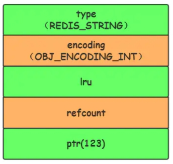

Redis 启动时会预先建立 10000 个分别存储 0~9999 的 redisObject 变量，作为共享对象，这就意味着如果 set 字符串的键值在 0~10000 之间的话，则可以**直接指向共享对象，而不需要再建立新对象，此时键值不占空间！**

```c
# object.c 源码

len = sdslen(s);
# 字符串长度小于等于 20，且字符串转成 long 类型成功
if (len <= 20 && string2l(s,len,&value)) {

	if ((server.maxmemory == 0 ||
		!(server.maxmemory_policy & MAXMEMORY_FLAG_NO_SHARED_INTEGERS)) &&
		value >= 0 &&
		value < OBJ_SHARED_INTEGERS)
	{
    # 配置 maxmemory，且值在 10000 以内，直接使用共享对象。OBJ_SHARED_INTEGERS 在 server.h 中定义 [#define OBJ_SHARED_INTEGERS 10000]
		decrRefCount(o);
		incrRefCount(shared.integers[value]);
		return shared.integers[value];
	} else {
		if (o->encoding == OBJ_ENCODING_RAW) {
			sdsfree(o->ptr);
			o->encoding = OBJ_ENCODING_INT;
			o->ptr = (void*) value;
			return o;
		} else if (o->encoding == OBJ_ENCODING_EMBSTR) {
			decrRefCount(o);
			return createStringObjectFromLongLongForValue(value);
		}
	}
}
```

**EMBSTR 编码格式：**

对于长度小于 44 的字符串，Redis 对键值采用 OBJ_ENCODING_EMBSTR 方式，EMBSTR 顾名思义即：embedded string，表示嵌入式的 string。从内存结构上来讲，即字符串 sds 结构体与其对应的 redisObject 对象分配在同一块连续的内存空间，字符串 sds 嵌入在 redisObject 对象之中一样。

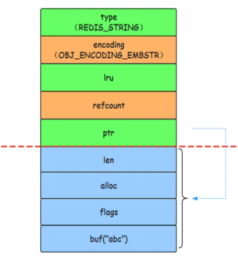

```c
# object.c 源码

# 字符串长度小于 44 的字符串。【#define OBJ_ENCODING_EMBSTR_SIZE_LIMIT 44】
if (len <= OBJ_ENCODING_EMBSTR_SIZE_LIMIT) {
	robj *emb;

	if (o->encoding == OBJ_ENCODING_EMBSTR) return o;
	emb = createEmbeddedStringObject(s,sdslen(s));
	decrRefCount(o);
	return emb;
}

# 将字符串转成 OBJ_ENCODING_EMBSTR 编码格式
robj *createEmbeddedStringObject(const char *ptr, size_t len) {
    robj *o = zmalloc(sizeof(robj)+sizeof(struct sdshdr8)+len+1);
    struct sdshdr8 *sh = (void*)(o+1);
		# string 类型
    o->type = OBJ_STRING;
    o->encoding = OBJ_ENCODING_EMBSTR;
    o->ptr = sh+1;
    o->refcount = 1;
    if (server.maxmemory_policy & MAXMEMORY_FLAG_LFU) {
        o->lru = (LFUGetTimeInMinutes()<<8) | LFU_INIT_VAL;
    } else {
        o->lru = LRU_CLOCK();
    }

    sh->len = len;
    sh->alloc = len;
    sh->flags = SDS_TYPE_8;
    if (ptr == SDS_NOINIT)
        sh->buf[len] = '\0';
    else if (ptr) {
        memcpy(sh->buf,ptr,len);
        sh->buf[len] = '\0';
    } else {
        memset(sh->buf,0,len+1);
    }
    return o;
}
```

**RAW 编码格式：**

当字符串的键值是长度大于 44 的超长字符串时，Redis 则会将键值的内部编码方式改为 OBJ_ENCODING_RAW 格式，这与 OBJ_ENCODING_EMBSTR 编码方式的不同之处在于，此时动态字符串 sds 的内存与其依赖的 redisObject 的内存不再连续。


```c
# object.c 源码

#define OBJ_ENCODING_EMBSTR_SIZE_LIMIT 44
robj *createStringObject(const char *ptr, size_t len) {
    if (len <= OBJ_ENCODING_EMBSTR_SIZE_LIMIT)
      	# 长度小于 44 的字符串，将其转换成 OBJ_ENCODING_EMBSTR 格式
        return createEmbeddedStringObject(ptr,len);
    else
      	# 长度超过 44 的字符串，将其转换成 OBJ_ENCODING_RAW 格式
        return createRawStringObject(ptr,len);
}
```

> 对于某些字符串，其长度没有超过 44，但格式却是 raw，其原因为：
>
> - 对于 embstr，由于其实现的是只读的，因此在对 embstr 对象进行修改时，都会先转成 raw，然后再进行修改。因此，只要是修改 embstr 对象，修改后的对象一定是 raw 的，无论是否达到了 44 个字节。

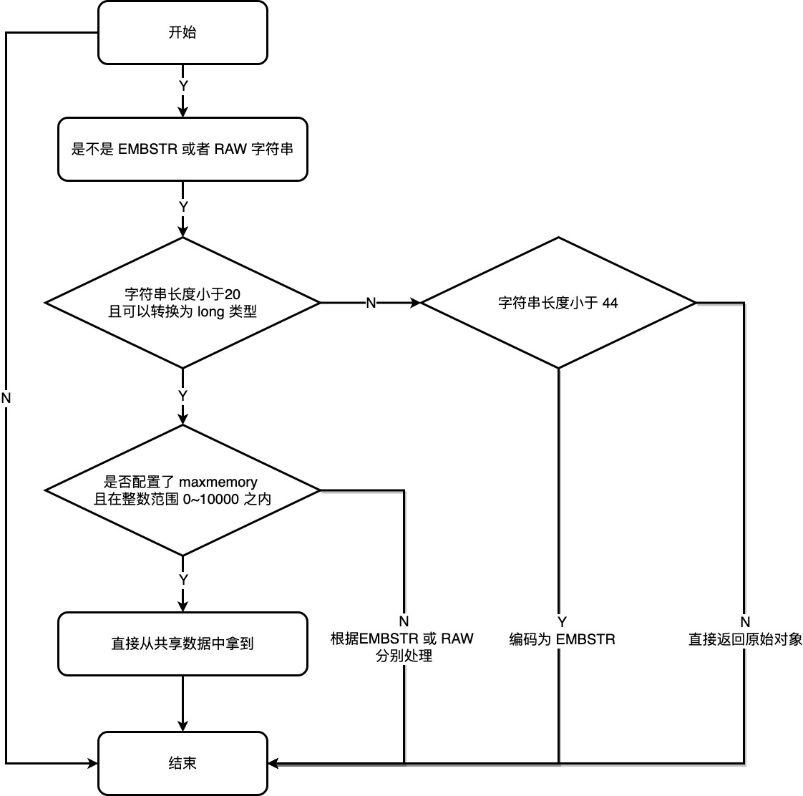

###### 总结

Redis 内部会根据用户给的不同键值而使用不同的编码格式，自适应地选择较优化的内部编码格式，而这一切对用户完全透明。只有整数才会使用 int，如果是浮点数， Redis 内部其实先将浮点数转化为字符串值，然后再保存。embstr 与 raw 类型底层的数据结构其实都是 SDS (简单动态字符串，Redis 内部定义 sdshdr 一种结构)。

| 类型   | 说明                                                         |
| ------ | ------------------------------------------------------------ |
| INT    | Long 类型整数时，RedisObject 中的 ptr 指针直接赋值为整数数据，不再额外的指针再指向整数了，节省了指针的空间开销。 |
| EMBSTR | 当保存的是字符串数据且字符串小于等于 44 字节时，embstr 类型将会调用内存分配函数，只分配一块连续的内存空间，空间中依次包含 redisObject 与 sdshdr 两个数据结构，让元数据、指针和 SDS 是一块连续的内存区域，这样就可以避免内存碎片 |
| RAW    | 当字符串大于 44 字节时，SDS 的数据量变多变大了，SDS 和 RedisObject 布局分家各自过，会给 SDS 分配更多的空间并用指针指向 SDS 结构，raw 类型将会调用两次内存分配函数，分配两块内存空间，一块用于包含 redisObject 结构，而另一块用于包含 sdshdr 结构 |

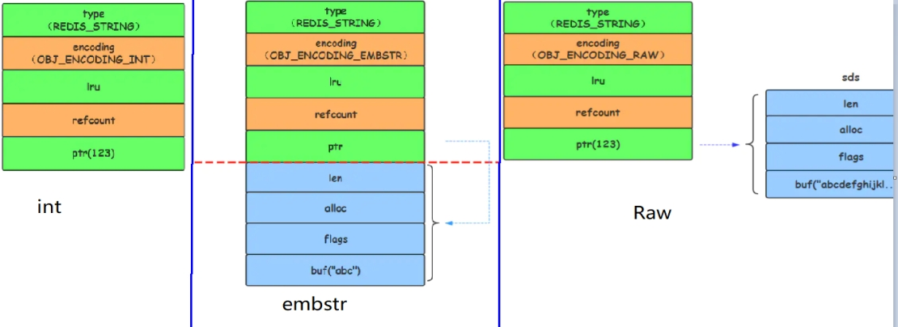

<br>

##### hash 数据结构

###### hash 的两种编码格式

- **ziplist**

- **hashtable**

<br>

###### ziplist 源码分析

ziplist 是一个经过特殊编码的双向链表，它不存储指向上一个链表节点和指向下一个链表节点的指针，而是存储上一个节点长度和当前节点长度，通过牺牲部分读写性能，来换取高效的内存空间利用率，节约内存，是一种时间换空间的思想。只用在字段个数少，字段值小的场景里面。

ziplist 的总体布局为：

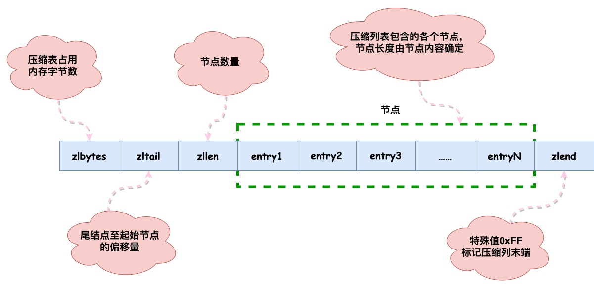

压缩列表各组成部分的详细说明

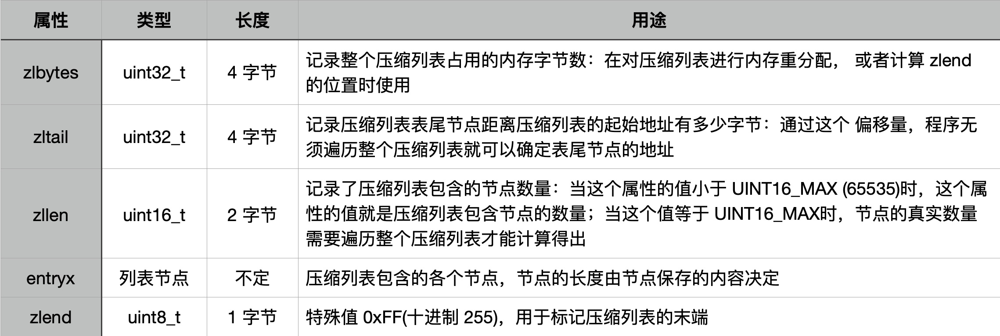

```c
# ziplist.c
typedef struct zlentry {
    unsigned int prevrawlensize; /* 上一个链表节点占用的长度 */
    unsigned int prevrawlen;     /* 存储上一个链表节点的常数数值所需要得字节数 */
    unsigned int lensize;        /* 存储当前链表节点长度数值所需要的字节数 */
    unsigned int len;            /* 当前链表节点占用的长度 */
    unsigned int headersize;     /* 当前链表节点的头部大小（prevrawlensize + lensize），即非数据域的大小 */
    unsigned char encoding;      /* 编码方式 */
    unsigned char *p;            /* 压缩链表以字符串的形式保存，该指针指向当前节点的起始位置 */
} zlentry;
```

压缩列表的遍历：通过指向表尾节点的位置指针 p1, 减去节点的 previous_entry_length，得到前一个节点起始地址的指针。如此循环，从表尾遍历到表头节点。从表尾向表头遍历操作就是使用这一原理实现的，只要我们拥有了一个指向某个节点起始地址的指针，那么通过这个指针以及这个节点的 previous_entry_length 属性程序就可以一直向前一个节点回溯，最终到达压缩列表的表头节点。

**ziplist 存取情况**：

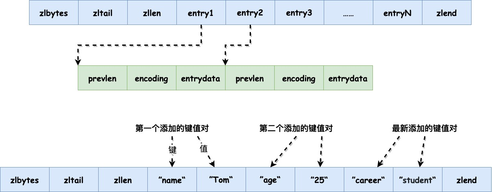

###### hashtable 源码分析

在 Redis 中，hashtable 被称为字典（dictionary），它是一个数组 + 链表的结构。

```c
# t_hash.c 源码
void hsetCommand(client *c) {
    int i, created = 0;
    robj *o;

    if ((c->argc % 2) == 1) {
        addReplyErrorFormat(c,"wrong number of arguments for '%s' command",c->cmd->name);
        return;
    }

    if ((o = hashTypeLookupWriteOrCreate(c,c->argv[1])) == NULL) return;
    hashTypeTryConversion(o,c->argv,2,c->argc-1);

    for (i = 2; i < c->argc; i += 2)
        created += !hashTypeSet(o,c->argv[i]->ptr,c->argv[i+1]->ptr,HASH_SET_COPY);

    /* HMSET (deprecated) and HSET return value is different. */
    char *cmdname = c->argv[0]->ptr;
    if (cmdname[1] == 's' || cmdname[1] == 'S') {
        /* HSET */
        addReplyLongLong(c, created);
    } else {
        /* HMSET */
        addReply(c, shared.ok);
    }
    signalModifiedKey(c,c->db,c->argv[1]);
    notifyKeyspaceEvent(NOTIFY_HASH,"hset",c->argv[1],c->db->id);
    server.dirty += (c->argc - 2)/2;
}
```

每个键值对都会有一个 dictEntry。OBJ_ENCODING_HT 这种编码方式内部才是真正的哈希表结构，或称为字典结构，其可以实现 O(1) 复杂度的读写操作，因此效率很高。在 Redis 内部，从 OBJ_ENCODING_HT 类型到底层真正的散列表数据结构是一层层嵌套下去的，组织关系见面图：

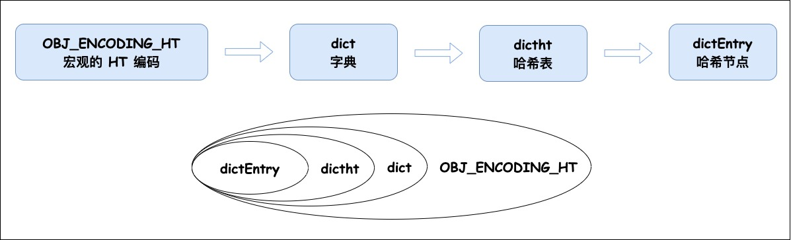

```c
# dict.h 源码
# dictEntry：哈希条目
typedef struct dictEntry {
    void *key;
    union {
        void *val;
        uint64_t u64;
        int64_t s64;
        double d;
    } v;
    struct dictEntry *next;
} dictEntry;

typedef struct dictType {
    uint64_t (*hashFunction)(const void *key);
    void *(*keyDup)(void *privdata, const void *key);
    void *(*valDup)(void *privdata, const void *obj);
    int (*keyCompare)(void *privdata, const void *key1, const void *key2);
    void (*keyDestructor)(void *privdata, void *key);
    void (*valDestructor)(void *privdata, void *obj);
    int (*expandAllowed)(size_t moreMem, double usedRatio);
} dictType;

# dictht：哈希表
typedef struct dictht {
    dictEntry **table;
    unsigned long size;
    unsigned long sizemask;
    unsigned long used;
} dictht;

# dict：字典
typedef struct dict {
    dictType *type;
    void *privdata;
    dictht ht[2];
    long rehashidx; /* rehashing not in progress if rehashidx == -1 */
    int16_t pauserehash; /* If >0 rehashing is paused (<0 indicates coding error) */
} dict;
```

```c
# t_hash.c 源码
void hashTypeTryConversion(robj *o, robj **argv, int start, int end) {
    int i;
    size_t sum = 0;

    if (o->encoding != OBJ_ENCODING_ZIPLIST) return;

    for (i = start; i <= end; i++) {
        if (!sdsEncodedObject(argv[i]))
            continue;
        size_t len = sdslen(argv[i]->ptr);
        if (len > server.hash_max_ziplist_value) {
          	# OBJ_ENCODING_HT
            hashTypeConvert(o, OBJ_ENCODING_HT);
            return;
        }
        sum += len;
    }
    if (!ziplistSafeToAdd(o->ptr, sum))
        hashTypeConvert(o, OBJ_ENCODING_HT);
}
```

<br>

##### List 数据结构

list 用 quicklist 来存储，quicklist 存储了一个双向链表，每个节点都是一个 ziplist。

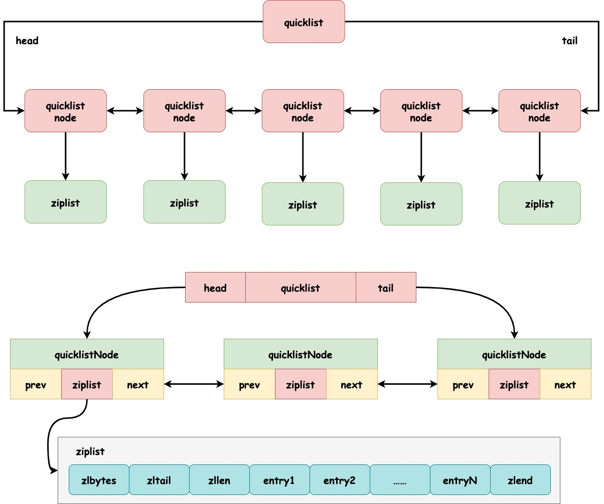

> 在低版本的 Redis 中，list 采用的底层数据结构是 ziplist + linkedList
>
> 在高版本的 Redis 中，list 采用的底层数据结构是 quicklist，它替换了 ziplist + linkedList，而 quicklist 也用到了 ziplist
>
> quicklist  实际上是 zipList 和 linkedList 的混合体，它将 linkedList 按段切分，每一段使用 zipList 来紧凑存储，多个 zipList 之间使用双向指针串接起来。

ziplist 的两种压缩配置。通过 `config get list*` 可以查看。

- list-compress-depth

  表示一个 quicklist 两端不被压缩的节点个数。这里的节点是指 quicklist 双向链表的节点，而不是指 ziplist 里面的数据项个数。

  > 参数 list-compress-depth 的取值含义如下：
  >
  > - 0: 是个特殊值，表示都不压缩。这是Redis的默认值。
  >
  > - 1: 表示 quicklist 两端各有 1 个节点不压缩，中间的节点压缩。
  >
  > - 2: 表示 quicklist 两端各有 2 个节点不压缩，中间的节点压缩。
  >
  > - 3: 表示 quicklist 两端各有 3 个节点不压缩，中间的节点压缩。

- list-max-ziplist-size

  当取正值的时候，表示按照数据项个数来限定每个 quicklist 节点上的 ziplist 长度。比如，当这个参数配置成 5 的时候，表示每个 quicklist 节点的 ziplist 最多包含 5 个数据项。当取负值的时候，表示按照占用字节数来限定每个 quicklist 节点上的 ziplist 长度。这时，它只能取 -1 到 -5 这五个值

  > 每个值含义如下:
  >
  > - -5: 每个 quicklist 节点上的 ziplist 大小不能超过 64 Kb。（注：1kb => 1024 bytes）
  >- -4: 每个 quicklist 节点上的 ziplist 大小不能超过 32 Kb。
  > - -3: 每个 quicklist 节点上的 ziplist 大小不能超过 16 Kb。
  >- -2: 每个 quicklist 节点上的 ziplist 大小不能超过 8 Kb。（-2是Redis给出的默认值）
  > - -1: 每个 quicklist 节点上的 ziplist 大小不能超过 4 Kb。

```c
# quicklist.h 源码
typedef struct quicklist {
    quicklistNode *head;					/* 指向双向列表的表头 */
    quicklistNode *tail;					/* 指向双向列表的表尾 */
    unsigned long count;        			/* 所有 ziplist 中一共存了多少个元素 */
    unsigned long len;          			/* 双向链表的长度，node 的数量 */
    int fill : QL_FILL_BITS;    			/* fill factor for individual nodes */
    unsigned int compress : QL_COMP_BITS; 	/* 压缩深度，0：不压缩 */
    unsigned int bookmark_count: QL_BM_BITS;
    quicklistBookmark bookmarks[];
} quicklist;


typedef struct quicklistNode {
    struct quicklistNode *prev;	 			/* 前一个节点 */
    struct quicklistNode *next;	 			/* 后一个节点 */
    unsigned char *zl;			 			/* 指向实际的 ziplist */
    unsigned int sz;             			/* 当前 ziplist 占用多少字节 */
    unsigned int count : 16;     			/* 当前 ziplist 中存储了多少个元素，占 16bit，最大 65536 个 */
    unsigned int encoding : 2;   			/* 是否采用了 LZF 压缩算法压缩节点，RAW==1 or LZF==2 */
    unsigned int container : 2;  			/* NONE==1 or ZIPLIST==2。未来可能支持其它结构存储 */
    unsigned int recompress : 1; 			/* 当前 ziplist 是不是已经被解压出来作临时使用 */
    unsigned int attempted_compress : 1; 	/* 测试用 */
    unsigned int extra : 10; 	 			/* 预留给未来使用 */
} quicklistNode;
```

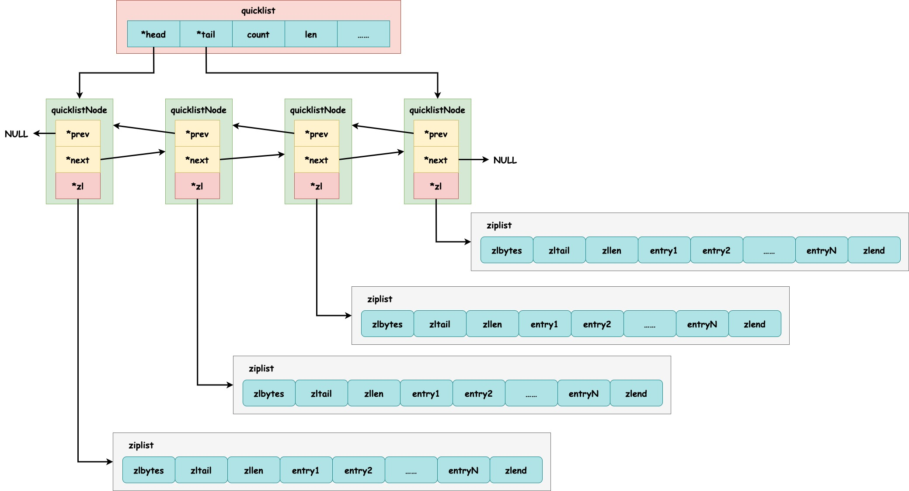

<br>

##### Set 数据结构

Redis 中 Set 数据类型有两种编码格式，intset 和 hashtable。

- intset：如果元素都是整数类型，就用 intset 编码格式存储
- hashtable：如果不是整数类型，就用 hashtable（数组 + 链表）编码格式存储。key 就是元素的值，value 为 null。

```c
# t_set.c 源码
void saddCommand(client *c) {
    robj *set;
    int j, added = 0;

    set = lookupKeyWrite(c->db,c->argv[1]);
    if (checkType(c,set,OBJ_SET)) return;
    
    if (set == NULL) {
        set = setTypeCreate(c->argv[2]->ptr);
        dbAdd(c->db,c->argv[1],set);
    }

    for (j = 2; j < c->argc; j++) {
        if (setTypeAdd(set,c->argv[j]->ptr)) added++;
    }
    if (added) {
        signalModifiedKey(c,c->db,c->argv[1]);
        notifyKeyspaceEvent(NOTIFY_SET,"sadd",c->argv[1],c->db->id);
    }
    server.dirty += added;
    addReplyLongLong(c,added);
}

int setTypeAdd(robj *subject, sds value) {
    long long llval;
    # OBJ_ENCODING_HT
    if (subject->encoding == OBJ_ENCODING_HT) {
        dict *ht = subject->ptr;
        dictEntry *de = dictAddRaw(ht,value,NULL);
        if (de) {
            dictSetKey(ht,de,sdsdup(value));
            dictSetVal(ht,de,NULL);
            return 1;
        }
      # OBJ_ENCODING_INTSET
    } else if (subject->encoding == OBJ_ENCODING_INTSET) {
        if (isSdsRepresentableAsLongLong(value,&llval) == C_OK) {
            uint8_t success = 0;
            subject->ptr = intsetAdd(subject->ptr,llval,&success);
            if (success) {
                /* Convert to regular set when the intset contains
                 * too many entries. */
                # server.set_max_intset_entries
                size_t max_entries = server.set_max_intset_entries;
                /* limit to 1G entries due to intset internals. */
                if (max_entries >= 1<<30) max_entries = 1<<30;
                if (intsetLen(subject->ptr) > max_entries)
                    setTypeConvert(subject,OBJ_ENCODING_HT);
                return 1;
            }
        } else {
            /* Failed to get integer from object, convert to regular set. */
            setTypeConvert(subject,OBJ_ENCODING_HT);

            /* The set *was* an intset and this value is not integer
             * encodable, so dictAdd should always work. */
            serverAssert(dictAdd(subject->ptr,sdsdup(value),NULL) == DICT_OK);
            return 1;
        }
    } else {
        serverPanic("Unknown set encoding");
    }
    return 0;
}
```

<br>

##### ZSet 数据结构

Redis 使用跳跃表作为有序集合（ZSet）的底层实现的两种时机配置。可以通过 config get zset* 查询。

Redis 底层实现 ZSet 的两种配置，可以通过 config get zset* 查询。

- zset_max_ziplist_entries：当有序集合中包含的元素数量超过服务器属性值（默认为 128）时，Redis 使用跳跃表作为有序集合的底层实现，否则会使用 ziplist 作为有序集合的底层实现
- zset_max_ziplist_value：当有序集合中新添加元素的 member 的长度大于服务器属性值（默认为 64）时，Redis 使用跳跃表作为有序集合的底层实现，否则会使用 ziplist 作为有序集合的底层实现

<br>

##### 数据结构总结

###### redis数据类型以及数据结构的关系

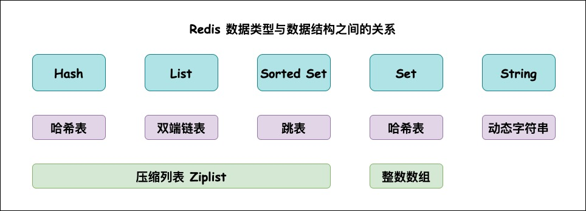

###### 不同数据类型对应的底层编码格式

- string

  > int：8个字节的长整型。
  >
  > embstr：小于等于 44 个字节的字符串。
  >
  > raw：大于 44 个字节的字符串。
  >
  > Redis 会根据当前值的类型和长度决定使用哪种内部编码实现。

- hash

  > ziplist（压缩列表）：当哈希类型元素个数小于 hash-max-ziplist-entries 配置（默认 512 个）、同时所有值都小于 hash-max-ziplist-value 配置（默认64 字节）时，Redis 会使用 ziplist 作为哈希的内部实现，ziplist 使用更加紧凑的结构实现多个元素的连续存储，所以在节省内存方面比 hashtable 更加优秀。
  >
  > hashtable（哈希表）：当哈希类型无法满足 ziplist 的条件时，Redis 会使用 hashtable 作为哈希的内部实现，因为此时 ziplist 的读写效率会下降，而 hashtable 的读写时间复杂度为 O(1)。
  
- list

  > ziplist（压缩列表）：当列表的元素个数小于 list-max-ziplist-entries 配置（默认 512 个），同时列表中每个元素的值都小于 list-max-ziplist-value 配置时（默认 64 字节），Redis 会选用 ziplist 来作为列表的内部实现来减少内存的使 用。
  >
  > linkedlist（链表）：当列表类型无法满足 ziplist 的条件时，Redis 会使用 linkedlist 作为列表的内部实现。quicklist ziplist 和 linkedlist 的结合以 ziplist 为节点的链表（linkedlist），Redis 高版本使用功能 quiklist，低版本使用 linkedlist。
  
- set

  > intset（整数集合）：当集合中的元素都是整数且元素个数小于 set-max- intset-entries 配置（默认 512 个）时，Redis 会选用 intset 来作为集合的内部实现，从而减少内存的使用。
  >
  > hashtable（哈希表）：当集合类型无法满足 intset 的条件时，Redis 会使用 hashtable 作为集合的内部实现。

- zset

  > ziplist（压缩列表）：当有序集合的元素个数小于 zset-max-ziplist- entries 配置（默认 128 个），同时每个元素的值都小于 zset-max-ziplist-value 配置（默认 64 字节）时，Redis 会用 ziplist 来作为有序集合的内部实现，ziplist 可以有效减少内存的使用。
  >
  > skiplist（跳跃表）：当 ziplist 条件不满足时，有序集合会使用 skiplist 作为内部实现，因为此时 ziplist 的读写效率会下降。

###### redis 数据类型以及数据结构的时间复杂度

| 名称     | 时间复杂度 |
| -------- | ---------- |
| 哈希表   | O(1)       |
| 跳表     | O(logN)    |
| 双向链表 | O(N)       |
| 压缩列表 | O(N)       |
| 整数数组 | O(N)       |

###### redis 数据类型与编码

<table>
  <tr>
  	<td>类型</td>
    <td>编码</td>
    <td>对象</td>
  </tr>
  <tr>
  	<td rowspan="3">REDIS_STRING</td>
    <td>REDIS_ENCODING_INT</td>
    <td>使用整数值实现的字符串对象</td>
  </tr>
  <tr>
    <td>REDIS_ENCODING_EMBSTR</td>
    <td>使用 embstr 编码的简单动态字符串实现的字符串对象</td>
  </tr>
  <tr>
    <td>REDIS_ENCODING_RAW</td>
    <td>使用简单动态字符串实现的字符串对象</td>
  </tr>
  <tr>
  	<td rowspan="2">REDIS_LIST</td>
    <td>REDIS_ENCODING_ZIPLIST</td>
    <td>使用压缩列表实现的列表对象</td>
  </tr>
  <tr>
    <td>REDIS_ENCODING_LINKEDLIST</td>
    <td>使用双端链表实现的列表对象</td>
  </tr>
  <tr>
  	<td rowspan="2">REDIS_HASH</td>
    <td>REDIS_ENCODING_ZIPLIST</td>
    <td>使用压缩列表实现的哈希对象</td>
  </tr>
  <tr>
    <td>REOIS_ENCODING_HT</td>
    <td>使用字典实现的哈希对象</td>
  </tr>
  <tr>
  	<td rowspan="2">REDIS_SET</td>
    <td>REDIS_ENCODING_INTSET</td>
    <td>使用整数集合实现的集合对象</td>
  </tr>
  <tr>
    <td>REDIS_ENCODING_HT</td>
    <td>使用字典实现的集合对象</td>
  </tr>
  <tr>
  	<td rowspan="2">REDIS_ZSET</td>
    <td>REDIS_ENCODING_ZIPLIST</td>
    <td>使用压缩列表实现的有序集合对象</td>
  </tr>
  <tr>
    <td>REDIS_ENCODING_SKIPLIST</td>
    <td>使用跳跃表和字典实现的有序集合对象</td>
  </tr>
</table>

<br>

#### skiplist 跳表面试题

##### skiplist 结构

- 是一种以空间换取时间的结构。由于链表，无法进行二分查找，因此借鉴数据库索引的思想，提取出链表中关键节点（索引），先在关键节点上查找，再进入下层链表查找。提取多层关键节点，就形成了跳跃表；
- 跳表 = 链表 + 多级索引

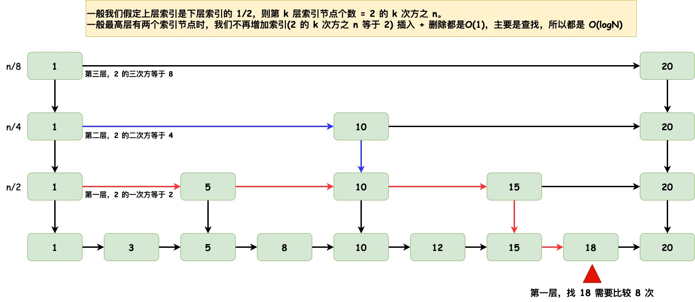

##### 跳表的时间复杂度

- 首先每一级索引我们提升了 2 倍的跨度，那就是减少了 2 倍的步数，所以是 n/2、n/4、n/8 以此类推；

- 第 k 级索引结点的个数就是 n/(2^k)；

- 假设索引有 h 级， 最高的索引有 2 个结点；n/(2^h) = 2,，从这个公式我们可以求得 h = log2(N)-1；

- 所以最后得出跳表的时间复杂度是 **O(logN)**

##### 跳表的空间复杂度

- 首先原始链表长度为 n

- 如果索引是每 2 个结点有一个索引结点，每层索引的结点数：n/2，n/4，n/8……， 8，4，2 以此类推；

- 或者所以是每 3 个结点有一个索引结点，每层索引的结点数：n/3，n/9，n/27……，9，3，1 以此类推；

- 所以空间复杂度是 O(n)；

##### 跳表的特点

- 跳表是一个最典型的空间换时间解决方案，而且只有在数据量较大的情况下才能体现出来优势。而且应该是读多写少的情况下才能使用，所以它的适用范围应该还是比较有限的

- 维护成本相对要高，新增或者删除时需要把所有索引都更新一遍；

- 在新增和删除的过程中的更新，时间复杂度也是 O(log n)。


---

### 布隆过滤器

#### 布隆过滤器定义

布隆过滤器（Bloom Filter）是 1970 年由布隆提出的。

**它实际上是一个很长的二进制数组加一些列随机 hash 算法映射函数，主要用于判断一个元素是否在集合中。即为由一个初始值都为 0 的 bit 数组和多个哈希表函数构成，主要用于快速判断某个数据是否存在。本质就是判断具体数据是否存在一个大的集合中。布隆过滤器是一种类似 set 的数据结构，只是统计结果不太准确。**

通常我们会遇到很多要判断一个元素是否在某个集合中的业务场景，一般想到的是将集合中所有元素保存起来，然后通过比较确定。链表、树、散列表（又叫哈希表，Hash table）等等数据结构都是这种思路。但是随着集合中元素的增加，我们需要的存储空间也会呈现线性增长，最终达到瓶颈。同时检索速度也越来越慢，上述三种结构的检索时间复杂度分别为O(n)、O(logn)、O(1)。这个时候，布隆过滤器（Bloom Filter）就应运而生。

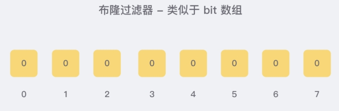

<br>

#### 布隆过滤器的特点

- 高效的插入和查询，占用空间少，返回的结果是不确定性的；
- 一个元素如果判断的结果为存在的时候，元素不一定存在；
- 一个元素如果判断的结果为不存在的时候，元素一定不存在；
- 布隆过滤器可以添加元素，但不能删除元素；因为删除元素会导致误判率增加
- 误判只会发生在过滤器没有添加过的元素的判断上，对于添加过的元素是不会发生误判的。
- 即判断结论是：有，是可能有；无，是一定无。

<br>

#### 布隆过滤器应用场景

- 解决缓存穿透的问题

  > 缓存穿透：
  >
  > - 一般情况下，先查询缓存 Redis 中是否存有该条数据，如果缓存中没有，再查询数据库。当数据库也不存在这条数据时，每次查询都要访问数据库，这就是缓存穿透
  > - 缓存穿透带来的问题是，当有大量请求查询数据库不存在的数据时，就会给数据库带来压力，甚至会拖垮数据库
  >
  > 布隆过滤器解决缓存穿透问题：
  >
  > - 把已经存在数据的 key 存在布隆过滤器中，相当于 redis 前面挡着一个布隆过滤器
  > - 当有新的请求时，先到布隆过滤器中查询是否存在
  > - 如果布隆过滤器中判断不存在该条数据，则直接返回
  > - 如果布隆过滤器中判断存在该条数据，才去查询缓存 redis，如果若 redis 中没有查询到，则再穿透到数据库去查询。

- 黑名单校验

  > 发现存在黑名单中的，就执行特定操作。比如：识别垃圾邮件，即只要是邮箱在黑名单中，就识别为垃圾邮件
  >
  > 假设黑名单的数量是数以亿计的，存放起来是非常耗费存储空间的，布隆过滤器则是一个较好的解决方案。
  >
  > 把所有黑名单都放在布隆过滤器中，在接收到邮件时，判断邮件地址是否在布隆过滤器中即可

<br>

#### 布隆过滤器原理

##### Java 中 传统 hash 函数

哈希函数的概念是：将任意大小的输入数据转换成特定大小的输出数据的函数，转换后的数据称为哈希值或哈希编码，也叫散列值。

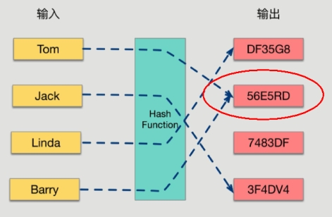

##### 散列（hash）函数的特点

- 如果两个散列值是不相同的（根据同一个 hash 函数计算），那么这两个散列值的原始输入也是不相同的。这个特性是散列函数具有确定性的结果，具有这种性质的散列函数称为单向散列函数。
- 散列函数的输入和输出不是唯一对应关系的，如果两个散列值此相同，两个输入值很可能是相同的，但也可能不同，这种情况称为散列碰撞（collision）
- 用 hash 表存储大数据量时，空间效率还是很低，当只有一个 hash 函数时，还很容易发生哈希碰撞。

<br>

##### 布隆过滤器原理

布隆过滤器（Bloom Filter）是一种专门用来解决去重问题的高级数据结构。实质就是**一个大型*位数组*和几个不同的无偏 hash 函数（无偏表示均匀分布）**。由一个初始值都为 0 的 bit 数组和多个哈希函数构成，用来快速判断某个数据是否存在。但跟 HyperLogLog 一样，它也有一点点不精确，也存在一定的误判率。

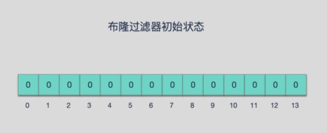

##### 布隆过滤器的操作

- **添加 key 时**：为了尽量地地址不冲突，会使用多个 hash 函数对 key 进行 hash 运算，得到一个整数索引值，然后对位数组长度进行取模运算，得到一个位置。每个 hash 函数都会得到一个不同的位置，再把位数组中的这几个位置都置为 1，就完成了添加操作。

  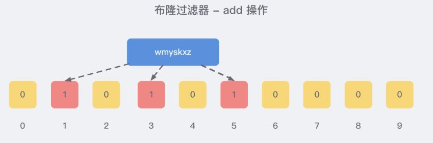

- **查询 key 时：**向布隆过滤器查询某个 key 是否存在时，先把这个 key 通过相同的多个 hash 函数进行运算，查看位数组对应的位置是否都为 1，只要其中有一个位置的值是 0，就说明布隆过滤器中这个 key 不存在，但如果位数组对应的位置都是 1，则说明这个 key 极有可能存在于在布隆过滤器中。因为这些位置的 1 可能是因为其它的 key 存在导致的，也就是发生了哈希冲突。例如，在添加字符串“wmyskxz”数据之后，很明显位数组在下标为 1、3、5 这几个位置的 1 是因为第一次添加字符串“wmyskxz”而导致的；此时我们查询一个没有添加过的不存在的字符串“inexistent-key”，它有可能计算后的位数组的下标也分别为 1、3、5 这个几个位置，而这几个位置都是 1，这就发生了 hash 冲突，就发生了误判

  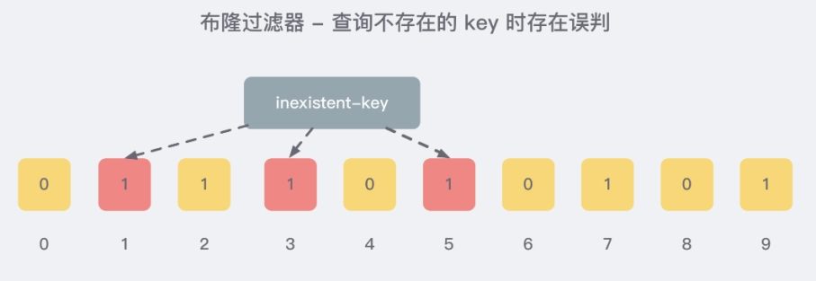

##### 布隆过滤器的存储过程

当有变量被加入到集合时，通过 N 个映射函数将这个变量映射成位图中的 N 个点，把他们置为 1（假定有两个变量都通过 3 个映射函数）。

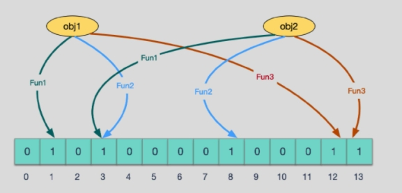

查询某个变量的时候，我们只要看这些点是不是都为 1，就可以大概率知道集合中有没有这个变量了。

如果这些点中，有任何一个为 0，则被查询变量**一定不存在**；

如果这些点都为 1，则被查询的变量**很可能存在**。**因为，映射函数本身就是散列函数，散列函数时会有碰撞的**。

> 正是基于布隆过滤器的快速检测的特性，我们可以把数据写入数据库时，使用布隆过滤器做个标记。当缓存缺失后，应用查询数据库时，可以通过查询布隆过滤器快速判断数据是否存在。如果不存在，就不用再去数据库中查询了。这样一来，即使发生了缓存穿透，大量请求只会查询 redis 和布隆过滤器，而不会积压到数据库，也就不会影响数据库的正常运行。布隆过滤器可以使用 redis 实现，本身就能承担较大的并发访问压力。

<br>

##### 布隆过滤器不能删除的原因

布隆过滤器的误判是指多个输入经过哈希之后在相同的 bit 位置 1 了，这样就无法判断究竟是哪个输入产生的，因此误判的根源在于相同的 bit 位被多次映射且置 1。这种情况也造成了布隆过滤器的删除问题，因为布隆过滤器的每一个 bit 并不是独占的，很有可能多个元素共享了某一位。如果我们直接删除这一位的话，会影响其他的元素。

> 布隆过滤器的特性：
>
> - 一个元素判断结果为没有时，则一定没有；
> - 一个元素判断结果为存在时，则不一定存在；
> - 布隆过滤器可以添加元素，但是不能删除元素。因为删掉元素会导致误判率增加。

##### 布隆过滤器使用时注意事项

- 使用时最好不要让实际元素数量远大于初始化数量。
- 当时间元素数量超过初始化数量时，应该对布隆过滤器进行重建，重新分配一个 size 更大的过滤器，再将所有的历史元素批量添加进去。

<br>

#### 布隆过滤器优缺点

优点：

- 高效的插入和查询，占用空间少

缺点：

- 不能删除元素，因为删除元素会导致误判率增加，因为 hash 冲突导致一个位置可能存在的东西是多个元素共有的，删除一个元素的同时，可能会吧其它元素在该位置的记录也删除了；
- 存在误判，不同的数据可能计算出相同的 hash 值。

---

### 缓存问题

#### 缓存预热

<br>

#### 缓存雪崩

##### 缓存雪崩的触发

当 redis 主机宕机了，redis 全盘崩溃了，或缓存中有大量数据同时过期，就发生了缓存雪崩。

##### 缓存雪崩的解决方案

- redis 缓存集群实现高可用：主从+哨兵或 redis cluster

- ehcache 本地缓存 + Hystrix 或 sentinel 限流&降级

- 开启 redis 持久化机制 aof/rdb，尽快恢复缓存集群

  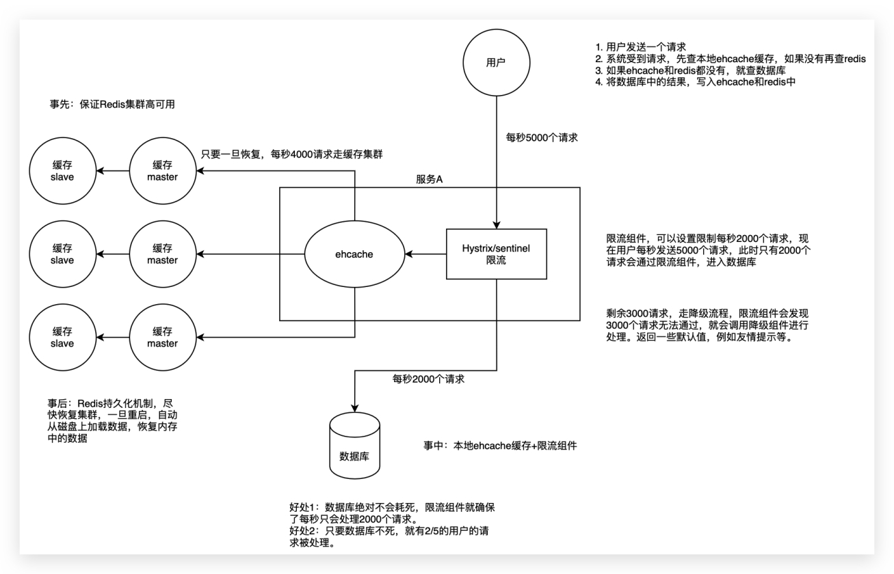

<br>

#### 缓存穿透

##### 缓存穿透的发生

请求去查询一条记录，先查 redis，后查数据库。发现都查询不到该条记录，但是请求每次都会打到数据库上面去，导致后台数据库压力暴增，这种现象我们称为缓存穿透，这个 redis变成了一个摆设。

##### 缓存穿透的解决方案

方案一：空对象缓存或缺省值。即一旦发生缓存穿透，针对查询的数据，在 redis 中缓存一个空值，或是和业务层协商确定的缺省值。紧接着，应用发送的后续请求再进行查询时，直接从 redis 中读取空缺省值，返回给业务应用，避免把大量请求发送给数据库处理，保持了数据库的正常运行。

方案二：使用 Google 的布隆过滤器 Guava 解决。但是 Guava 只能单机使用，不能应用于分布式场景。

方案三：使用 redis 布隆过滤器解决。以 redis 布隆过滤器为例，实现白名单过滤器。

白名单过滤器架构说明：

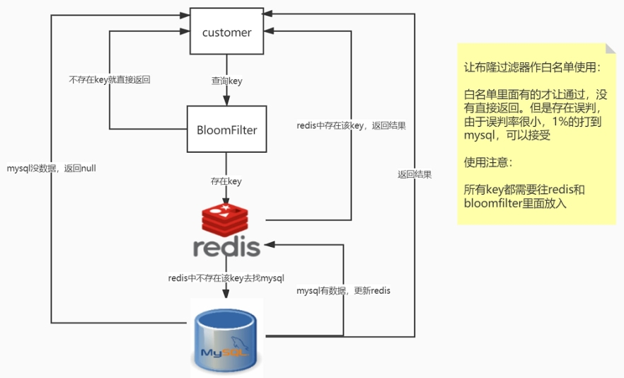

- 误判问题，但是概率小，key 接受，不能从布隆过滤器删除
- 全部合法的 key 都要存放入过滤器和 redis 中，否则数据就是返回 null

##### Redis 布隆过滤器代码测试

```java
public class RedisBloomFilterDemo {

    public static final int _1W = 10000;
    // 布隆过滤器里预计要插入多少数据
    public static int size = 100 * _1W;
    // 误判率,它越小误判的个数也就越少，但误判率越小，哈希函数越多，计算耗时越长，性能越低，0.03 是最优选择
    public static double fpp = 0.03;

    // redisson
    static RedissonClient redissonClient = null;
    // redis 版内置的布隆过滤器
    static RBloomFilter rBloomFilter = null;

    @Resource
    RedisTemplate redisTemplate;

    static {
        // redisson 配置
        Config config = new Config();
        config.useSingleServer().setAddress("redis://127.0.0.1:6379").setDatabase(0);
        // 构造 redisson
        redissonClient = Redisson.create(config);
        // 通过 redisson 构造 rBloomFilter
        rBloomFilter = redissonClient.getBloomFilter("phoneListBloomFilter",new StringCodec());
        rBloomFilter.tryInit(size,fpp);

        // 1.测试布隆过滤器有 + redis 有
        rBloomFilter.add("10086");
        redissonClient.getBucket("10086",new StringCodec()).set("chinamobile10086");

        // 2.测试布隆过滤器有 + redis 无
        //rBloomFilter.add("10087");

        //3 测试布隆过滤器无 + redis 无
    }

    private static String getPhoneListById(String IDNumber){

        String result = null;
        if (IDNumber == null) {
            return null;
        }

        // 1.先去布隆过滤器中查询
        if (rBloomFilter.contains(IDNumber)){
            // 2.布隆过滤器判断数据存在，再去 redis 中读取数据
            RBucket<String> rBucket = redissonClient.getBucket(IDNumber, new StringCodec());
            result = rBucket.get();
            if (result != null){
                // redis 中存在数据，直接返回结果
                return "i come from redis: "+result;
            }else {
                // redis 中不存在该数据，布隆过滤器发生了误判，再去数据库中查询数据
                result = getPhoneListByMySQL(IDNumber);
                if (result == null) {
                    // 数据库中也没有该条数据，直接返回空值
                    return null;
                }
                // 数据库中存在该条数据，重新将数据更新回 redis
                redissonClient.getBucket(IDNumber, new StringCodec()).set(result);
            }
            return "i come from mysql: "+result;
        }
        return result;
    }

    // 模拟从数据库中查询数据
    private static String getPhoneListByMySQL(String IDNumber) {
        return "chinamobile"+IDNumber;
    }

    public static void main(String[] args) {
        String phoneListById = getPhoneListById("10086");
        // String phoneListById = getPhoneListById("10087"); // 请测试执行2次
        // String phoneListById = getPhoneListById("10088");
        System.out.println("------查询出来的结果： "+phoneListById);

        //暂停几秒钟线程
        try { TimeUnit.SECONDS.sleep(1); } catch (InterruptedException e) { e.printStackTrace(); }
        redissonClient.shutdown();
    }
}
```

<br>

#### 缓存击穿

##### 缓存击穿的发生

大量的请求查询同一个 key 时，此时这个 key 正好失效了，就会导致大量的请求打到数据库上面去。简单说就是热点 key 突然失效了，暴打数据库。会造成某一时刻数据库的请求量过大，压力剧增。

##### 缓存击穿的解决方案

方案一：互斥更新、随机退避、差异失效时间；

方案二：对于热点 key，不设置过期时间；

方案三：互斥独占锁防止击穿。多个线程同时去查数据库的某条数据，那么可以在第一个查询数据的请求上使用一个互斥锁来锁住它。其它线程走到这一步，无法获取到锁，就等待，等第一个线程查询到了数据，然后做缓存，后面的线程进来直接走缓存。

```java
public String get(String key){
    // 查询缓存
    String value = redis.get(key);

    if (value != null){
        // 缓存存在，直接返回缓存结果
        return value;
    } else {
        // 缓存不存在，则对方法加锁
        // 假设请求量很大，缓存过期
        synchronized (TestFuture.class){
            // 再查询一次缓存
            value = redis.get(key);
            if (value != null){
                // 缓存存在，直接返回缓存结果
                return value;
            } else {
                // 二次查询缓存，未查到数据，此时查询数据库
                value = dao.get(key);
                // 数据缓存
                redis.setnx(key,value,time);
                // 返回数据
                return value；
            }
        }
    }
}
```

<br>

##### 缓存击穿案例

高并发的淘宝聚划算案例

- 高并发场景，不可以使用 mysql 实现
- 先把 mysql 中参见活动的数据抽取到 redis 中，一般采用定时扫描来决定上线活动还是下线取消
- 支持分页功能

解决缓存击穿的思路是：定时轮询，互斥更新，差异失效时间

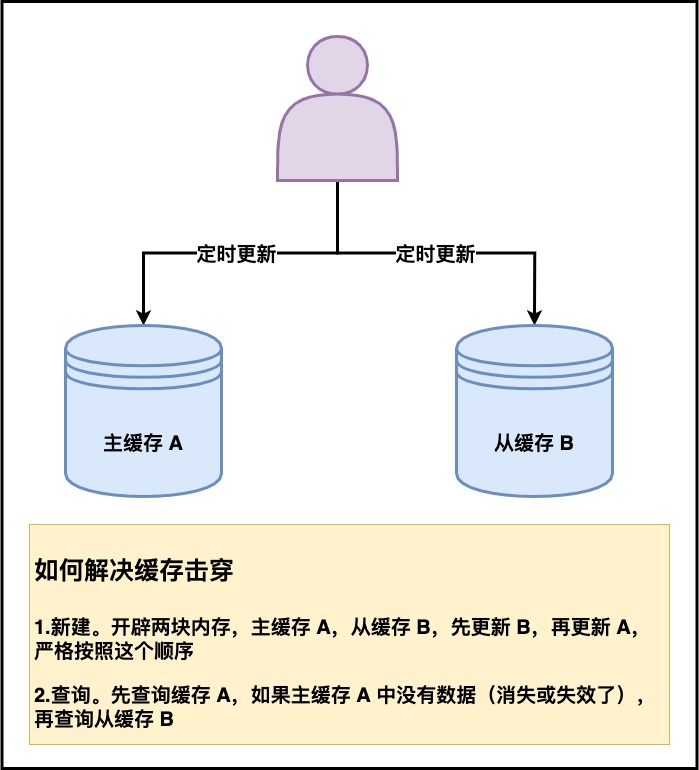

代码演示

```java
// 采用定时器将参与聚划算活动的特价商品新增进入redis中
@Service
@Slf4j
public class JHSTaskService {

    @Autowired
    private RedisTemplate redisTemplate;

    @PostConstruct
    public void initJHS(){

        log.info(" 启动定时器淘宝聚划算功能模拟 .........." + DateUtil.now());
        new Thread(()->{
            // 模拟定时器，定时把数据库的特价商品，刷新到 redis 中
            while (true){
                // 模拟从数据库读取 100 件特价商品，用于加载到聚划算的页面中
                List<Product> list = this.products();

                // 先更新 B 缓存
                this.redisTemplate.delete(Constants.JHS_KEY_B);
                this.redisTemplate.opsForList().leftPushAll(Constants.JHS_KEY_B,list);
                this.redisTemplate.expire(Constants.JHS_KEY_B,20L,TimeUnit.DAYS);

                //再更新 A 缓存
                this.redisTemplate.delete(Constants.JHS_KEY_A);
                this.redisTemplate.opsForList().leftPushAll(Constants.JHS_KEY_A,list);
                this.redisTemplate.expire(Constants.JHS_KEY_A,15L,TimeUnit.DAYS);

                // 间隔一分钟 执行一遍
                try {TimeUnit.MINUTES.sleep(1);} catch (InterruptedException e) {e.printStackTrace();}
                log.info("runJhs 定时刷新 ..............");
            }
        },"thread-A").start();
    }

    /**
     * 模拟从数据库读取 100 件特价商品，用于加载到聚划算的页面中
     */
    public List<Product> products(){
        List<Product> list = new ArrayList<>();
        for (int i = 0; i < 100; i++) {
            Random random = new Random();
            int id = random.nextInt(10000);
            Product product= new Product(( long ) id,"product" +i,i,"detail");
            list.add(product);
        }
        return list;
    }
}
```

```java
@RestController
@Slf4j
@Api(description="聚划算商品列表接口")
public class JHSProductController {

    @Autowired
    private RedisTemplate redisTemplate;

    @RequestMapping(value = "/pruduct/findab" ,method = RequestMethod.GET)
    @ApiOperation("按照分页和每页显示容量，点击查看 AB")
    public List<Product> find(int page,int size){

        List<Product> list = null;
        long start = (page - 1 ) * size;
        long end = start + size - 1 ;
        
        try {
            // 采用 redis list 数据结构的 lrange 命令实现分页查询。先查询主缓存 A
            list = this.redisTemplate.opsForList().range(Constants.JHS_KEY_A, start, end);
            if (CollectionUtils.isEmpty(list)){
                log.info("========= A 缓存已经失效了，记得人工修补，B 缓存自动延续 5 天 " );
                // 用户先查询缓存 A(上面的代码)，如果缓存 A 查询不到（例如，更新缓存的时候删除了），再查询缓存 B
                this.redisTemplate.opsForList().range(Constants.JHS_KEY_B, start, end);
            }
            log.info("查询结果：{}",list);
        }catch (Exception e){
            // 这里的异常，一般是 redis 瘫痪 ，或 redis 网络 timeout
            log.error("exception:" , e);
            // TODO 走 DB 查询
        }
        return list;
    }
}
```

<br>

#### 总结

| 缓存问题     | 产生原因               | 解决方案                                                     |
| ------------ | ---------------------- | ------------------------------------------------------------ |
| 缓存更新方式 | 数据变更、缓存时效性   | 同步更新、失效更新、异步更新、定时更新                       |
| 缓存不一致   | 同步更新失败、异步更新 | 增加重试、补偿任务、最终一致                                 |
| 缓存穿透     | 恶意攻击               | 空对象缓存、布隆过滤器                                       |
| 缓存击穿     | 热点 key 失效          | 互斥更新(加锁)、差异失效时间(设置主副缓存，查询与添加缓存的顺序对调) |
| 缓存雪崩     | 缓存宕机               | 快速失败熔断、主从复制、高可用集群模式                       |

---

### Redis 分布式锁

#### 分布式锁的条件

- 独占性：任何时刻有且只有一个线程持有该锁
- 高可用：集群环境下，不能因为某一个节点的宕机，而出现获取锁和释放锁失败的情况
- 防死锁：杜绝死锁，必须有超时控制机制或撤销操作，有兜底终止跳出方案
- 不乱抢：防止张冠李戴，不能私下 unlock 其它线程的锁，只能自己加锁，自己释放锁
- 重入性：同一个节点的同一个线程，如果获得锁之后，它也可以再次获得这个锁

<br>

#### Redisson 分布式锁

##### RedLock 算法

http://redis.cn/topics/distlock.html

##### Redisson

Redisson 是 java 的 redis 客户端之一，提供了一些 api 方便操作 redis。

Redisson 实现 RedLock 算法，用于来实现基于多个实例的分布式锁。锁变量由多个实例维护，即使有的实例发生了故障，客户端还是可以完成锁操作。

Redisson 实现分布式锁：https://github.com/redisson/redisson/wiki/8.-Distributed-locks-and-synchronizers

##### Redisson 算法的设计理念

该方案也是基于（set 加锁、Lua 脚本解锁）进行改良的，所以 redis 之父 antirez 只描述了差异的地方，大致方案如下。

假设我们有 N 个 Redis 主节点，例如 N = 5，这些节点是完全独立的，我们不使用复制或任何其他隐式协调系统，为了取到锁客户端执行以下操作：

1. 获取当前时间，以毫秒为单位；
2. 依次尝试从 5 个实例，使用相同的 key 和随机值（例如 UUID）获取锁。当向 Redis 请求获取锁时，客户端应该设置一个超时时间，这个超时时间应该小于锁的失效时间。例如你的锁自动失效时间为 10 秒，则超时时间应该在 5-50 毫秒之间。这样可以防止客户端在试图与一个宕机的 Redis 节点对话时，长时间处于阻塞状态。如果一个实例不可用，客户端应该尽快尝试去另外一个 Redis 实例请求获取锁；
3. 客户端通过当前时间减去步骤 1 记录的时间来计算获取锁使用的时间。当且仅当从大多数（N/2+1，这里是 3 个节点）的 Redis 节点都取到锁，并且获取锁使用的时间小于锁失效时间时，锁才算获取成功；
4. 如果取到了锁，其真正有效时间等于初始有效时间减去获取锁所使用的时间（步骤 3 计算的结果）；
5. 如果由于某些原因未能获得锁（无法在至少 N/2 + 1 个 Redis 实例获取锁、或获取锁的时间超过了有效时间），客户端应该在所有的 Redis 实例上进行解锁（即便某些 Redis 实例根本就没有加锁成功，防止某些节点获取到锁但是客户端没有得到响应而导致接下来的一段时间不能被重新获取锁）。

该方案为了解决数据不一致的问题，直接舍弃了异步复制只使用 master 节点，同时由于舍弃了 slave，为了保证可用性，引入了 N 个节点，官方建议是 5。

客户端只有在满足下面的这两个条件时，才能认为是加锁成功

1. 客户端从超过半数（大于等于N/2+1）的Redis实例上成功获取到了锁；
2. 客户端获取锁的总耗时没有超过锁的有效时间。

<br>

#### Redisson 源码解析

```java
public class WatchDogDemo {

    public static final String LOCKKEY = "colin_key";
    private static Config config;
    private static Redisson redisson;

    static {
        config = new Config();
        config.useSingleServer().setAddress("redis://"+"127.0.0.1"+":6379").setDatabase(0);
        redisson = (Redisson)Redisson.create(config);
    }

    public static void main(String[] args) {

        RLock redissonLock = redisson.getLock(LOCKKEY);
        redissonLock.lock();
        // 多次加锁，验证锁的可重入性，但要保证加锁与解锁成对出现
        /*redissonLock.lock();
        redissonLock.lock();*/

        try {
            System.out.println("1111");
            // 暂停几秒钟线程
            try { TimeUnit.SECONDS.sleep(3); } catch (InterruptedException e) { e.printStackTrace(); }
        }catch (Exception e){
            e.printStackTrace();
        }finally {
            if (redissonLock.isLocked() && redissonLock.isHeldByCurrentThread()){
                redissonLock.unlock();
                /*redissonLock.lock();
                redissonLock.lock();*/
            }
        }

        System.out.println(Thread.currentThread().getName() + " main ------ ends.");

        // 暂停几秒钟线程
        try { TimeUnit.SECONDS.sleep(3); } catch (InterruptedException e) { e.printStackTrace(); }
        redisson.shutdown();
    }
}
```

##### 缓存续命

Redis 分布式锁过期了，但是业务逻辑还没处理完，需要对锁进行续命。Redisson 的实现方案是，使用 `看门狗` 来定期检查（每 1/3 的锁时间检查一次），如果线程还持有锁，则刷新过期时间。即获取锁成功后，给锁加一个 watchdog，watchdog 会另起一个定时任务，在锁没有被释放且快要过期的时候对锁进行续期。

```java
// RedissonLock 在创建时，构造方法中定义锁的过期时间
public RedissonLock(CommandAsyncExecutor commandExecutor, String name) {
  super(commandExecutor, name);
  this.commandExecutor = commandExecutor;
  this.id = commandExecutor.getConnectionManager().getId();
  // Config 类中配置的锁过期时间 lockWatchdogTimeout = 30 * 1000，即默认锁过期时间 30s
  this.internalLockLeaseTime = commandExecutor.getConnectionManager().getCfg().getLockWatchdogTimeout();
  this.entryName = id + ":" + name;
  this.pubSub = commandExecutor.getConnectionManager().getSubscribeService().getLockPubSub();
}
```

##### 加锁源码

```java
private <T> RFuture<Long> tryAcquireAsync(long waitTime, long leaseTime, TimeUnit unit, long threadId) {
  // 首次加锁，leaseTime = -1
  if (leaseTime != -1) {
    return tryLockInnerAsync(waitTime, leaseTime, unit, threadId, RedisCommands.EVAL_LONG);
  }
  // 首次加锁运行至此。tryLockInnerAsync：尝试加锁（加锁逻辑）
  RFuture<Long> ttlRemainingFuture = tryLockInnerAsync(waitTime,
                                                       commandExecutor.getConnectionManager().getCfg().getLockWatchdogTimeout(),
                                                       TimeUnit.MILLISECONDS, threadId, RedisCommands.EVAL_LONG);
  ttlRemainingFuture.onComplete((ttlRemaining, e) -> {
    if (e != null) {
      return;
    }

    // lock acquired
    if (ttlRemaining == null) {
      // 加锁成功后运行至此。scheduleExpirationRenewal：定时续期
      scheduleExpirationRenewal(threadId);
    }
  });
  return ttlRemainingFuture;
}

// 尝试加锁（加锁逻辑）
<T> RFuture<T> tryLockInnerAsync(long waitTime, long leaseTime, TimeUnit unit, long threadId, RedisStrictCommand<T> command) {
  internalLockLeaseTime = unit.toMillis(leaseTime);

  return evalWriteAsync(getName(), LongCodec.INSTANCE, command,
                        "if (redis.call('exists', KEYS[1]) == 0) then " +
                        "redis.call('hincrby', KEYS[1], ARGV[2], 1); " +
                        "redis.call('pexpire', KEYS[1], ARGV[1]); " +
                        "return nil; " +
                        "end; " +
                        "if (redis.call('hexists', KEYS[1], ARGV[2]) == 1) then " +
                        "redis.call('hincrby', KEYS[1], ARGV[2], 1); " +
                        "redis.call('pexpire', KEYS[1], ARGV[1]); " +
                        "return nil; " +
                        "end; " +
                        "return redis.call('pttl', KEYS[1]);",
                        Collections.singletonList(getName()), internalLockLeaseTime, getLockName(threadId));
}
```

> 加锁的 lua 脚本
>
> KEYS[1 ]：代表的是你加锁的那个 key。`RLock redissonLock = redisson.getLock("colin_key")`，这里 `colin_key` 就是那个锁 key
>
> ARGV[2]：代表的是加锁的客户端的 ID，例如：7bcf6a9f-e7f7-49b0-9727-141df3b88038:117
>
> ARGV[1]：就是锁 key 的默认生存时间，默认是 30s
>
> 如何加锁：如果要加锁的那个锁 key 不存在的话，就进行加锁，hincrby 加锁客户端 ID 1，接着会执行 pexpire colin_key 30000，即给锁 key 设置过期时间。
>
> Lua 脚本加锁过程解析
>
> 1. 通过 exists 判断，如果锁不存在，则设置值和过期时间，加锁成功
> 2. 通过 hexists 判断，如果锁已存在，并且锁的是当前线程，则证明是重入锁，加锁成功
> 3. 如果锁已存在，但锁的不是当前线程，则证明有其他线程持有锁。返回当前锁的过期时间(代表了 `colin_key` 这个锁 key 的剩余生存时间)，加锁失败
>
> 加锁成功后，在 redis 的内存数据中，就有一条 **hash** 结构的数据。Key 为锁的名称；field 为随机字符串+线程ID；值为 1。并且，如果同一线程多次调用 lock 方法，值递增1，即可重入锁见后
>
> ```sh
> localhost:0>HGETALL colin_key
> 1) "bc4d837c-d685-443a-8d63-c4308022cbde:1"
> 2) "3"
> ```

```java
// 定时续期
private void scheduleExpirationRenewal(long threadId) {
  ExpirationEntry entry = new ExpirationEntry();
  ExpirationEntry oldEntry = EXPIRATION_RENEWAL_MAP.putIfAbsent(getEntryName(), entry);
  if (oldEntry != null) {
    oldEntry.addThreadId(threadId);
  } else {
    entry.addThreadId(threadId);
    // 续期
    renewExpiration();
  }
}

// 续期
private void renewExpiration() {
  ExpirationEntry ee = EXPIRATION_RENEWAL_MAP.get(getEntryName());
  if (ee == null) {
    return;
  }
	// 初始化了一个定时器，时间间隔的时间是 internalLockLeaseTime / 3，即三分之一锁过期时间，也就是每隔 10s 续期一次，每次 30s。
  Timeout task = commandExecutor.getConnectionManager().newTimeout(new TimerTask() {
    @Override
    public void run(Timeout timeout) throws Exception {
      ExpirationEntry ent = EXPIRATION_RENEWAL_MAP.get(getEntryName());
      if (ent == null) {
        return;
      }
      Long threadId = ent.getFirstThreadId();
      if (threadId == null) {
        return;
      }

      RFuture<Boolean> future = renewExpirationAsync(threadId);
      future.onComplete((res, e) -> {
        if (e != null) {
          log.error("Can't update lock " + getName() + " expiration", e);
          return;
        }

        if (res) {
          // reschedule itself
          renewExpiration();
        }
      });
    }
  }, internalLockLeaseTime / 3, TimeUnit.MILLISECONDS);

  ee.setTimeout(task);
}
```

> 若客户端 A 加锁成功，就会启动一个 watchdog 看门狗，它是一个后台线程，会每隔 10s 检查一下，如果客户端 A 还持有锁 key，那么就会不断的延长锁 key 的生存时间，默认每次续命后，锁过期时间又从 30s 重新开始

##### 解锁源码

```java
protected RFuture<Boolean> unlockInnerAsync(long threadId) {
  return evalWriteAsync(getName(), LongCodec.INSTANCE, RedisCommands.EVAL_BOOLEAN,
                        "if (redis.call('hexists', KEYS[1], ARGV[3]) == 0) then " +
                        "return nil;" +
                        "end; " +
                        "local counter = redis.call('hincrby', KEYS[1], ARGV[3], -1); " +
                        "if (counter > 0) then " +
                        "redis.call('pexpire', KEYS[1], ARGV[2]); " +
                        "return 0; " +
                        "else " +
                        "redis.call('del', KEYS[1]); " +
                        "redis.call('publish', KEYS[2], ARGV[1]); " +
                        "return 1; " +
                        "end; " +
                        "return nil;",
                        Arrays.asList(getName(), getChannelName()), LockPubSub.UNLOCK_MESSAGE, internalLockLeaseTime, getLockName(threadId));
}
```

> Lua 脚本释放锁锁过程解析
>
> 1. 如果释放锁的线程和已经存在锁的线程不是同一个线程，则返回 null
> 2. 通过 hincrby 递减 1，先释放一次锁。若剩余次数还大于 0，则证明当前锁时重入锁，刷新过期时间
> 3. 若剩余次数小于 0，删除 key 并发布锁释放的消失，解锁成功


---

### Redis 缓存过期淘汰策略

#### Redis 内存配置

Redis 配置文件 redis.conf 中，通过设置 maxmemory 的数值，可以设置 Redis 的内存大小。maxmemory 是 bytes 字节类型，设置是注意单位转换。

如果不设置最大内存大小或者设置最大内存大小为 0，则在 64 位操作系统下，其效果为不限制内存大小，在 32 位操作系统下，其效果为最多使用 3GB 内存。

生产环境一般推荐将 Redis 内存设置为最大物理内存的四分之三。设置完成后，可以通过命令 `info memory`，查看内存的使用情况。

如果 Redis 内存大小设置的过小，可能会造成 OOM

<br>

#### Redis 的删除策略

Redis 中过期键的删除策略分三种：

##### 立即删除：

立即删除能保证内存中数据的最大新鲜度，因为它保证过期键值会在过期后马上被删除，其所占用的内存也会随之释放。但是立即删除对 cpu 是最不友好的。因为删除操作会占用 cpu 的时间，如果刚好碰上了 cpu 很忙的时候，比如正在做交集或排序等计算的时候，就会给 cpu 造成额外的压力。这会产生大量的性能消耗，同时也会影响数据的读取操作。

##### 惰性删除

- 数据到达过期时间，不做处理。等下次访问该数据时，如果未过期，返回数据 ；如果发现已过期，则立即删除，返回不存在。

- 惰性删除策略的缺点是，它对内存是最不友好的。

- 在使用惰性删除策略时，如果数据库中有非常多的过期键，而这些过期键又恰好没有被访问到的话，那么它们也许永远也不会被删除(除非用户手动执行FLUSHDB)，我们甚至可以将这种情况看作是一种内存泄漏–无用的垃圾数据占用了大量的内存，而服务器却不会自己去释放它们，这对于运行状态非常依赖于内存的 Redis 服务器来说,肯定不是一个好消息
- 即惰性删除策略，对内存不友好，用存储空间换取处理器性能（拿空间换时间）

##### 定期删除：

定期删除策略是前两种策略的折中。定期删除策略是每隔一段时间执行一次删除过期键操作，并通过限制删除操作执行的时长和频率来减少删除操作对 CPU 时间的影响。即周期性抽查存储空间 （随机抽查，重点抽查） 

周期性轮询 redis 库中的时效性数据，采用随机抽取的策略，利用过期数据占比的方式控制删除频度 。其特点如下:

- CPU 性能占用设置有峰值，检测频度可自定义设置 
- 内存压力不是很大，长期占用内存的冷数据会被持续清理 

redis 默认每隔 100ms 检查一次是否有过期的 key，有过期 key，则删除。注意：redis 不是每隔 100ms 将所有的 key 检查一次，而是随机抽取进行检查。因此，如果只采用定期删除策略，会导致很多 key 到时间没有删除。

定期删除策略的难点是确定删除操作执行的时长和频率：如果删除操作执行得太频繁，或者执行的时间太长，定期删除策略就会退化成立即删除策略，以至于将 CPU 时间过多地消耗在删除过期键上面。如果删除操作执行得太少，或者执行的时间太短，定期删除策略又会和惰性删除束略一样，出现浪费内存的情况。因此，如果采用定期删除策略的话，服务器必须根据情况，合理地设置删除操作的执行时长和执行频率。

<br>

#### Redis 缓存淘汰策略

##### Redis 缓存淘汰策略有以下几种

- noeviction：不会驱逐任何 key
- allkeys-lru：对所有 key 使用 LRU 算法进行删除
- volatile-lru：对所有设置了过期时间的 key 使用 LRU 算法进行删除
- allkeys-random：对所有 key 随机删除
- volatile-random：对所有设置了过期时间的 key 随机删除
- volatile-ttl：删除马上要过期的 key
- allkeys-lfu：对所有 key 使用 LFU 算法进行删除
- volatile-lfu：对所有设置了过期时间的 key 使用 LFU 算法进行删除

##### 淘汰策略的分类

###### 两个维度

- 从过期键中筛选
- 从所有键中筛选

###### 四个方面

- LRU
- LFU
- 随机
- ttl

---

### Redis 与数据库双写一致性

#### Canal

Canal 是基于 MySQL 变更日志增量订阅和消费的组件。主要作用是：

- 数据库镜像
- 数据库实时备份
- 索引构建和实时维护(拆分异构索引、倒排索引等)
- 业务 cache 刷新
- 带业务逻辑的增量数据处理

<br>

#### MySQL主从复制工作原理

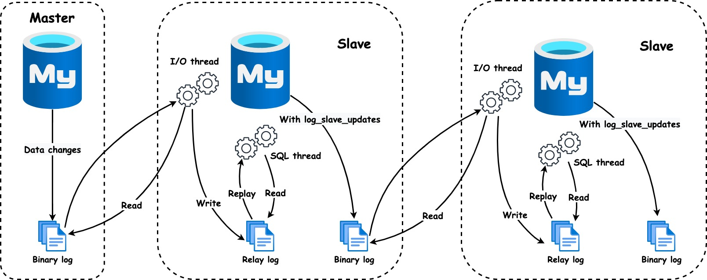

MySQL的主从复制将经过如下步骤：

1. 当 master 主服务器上的数据发生改变时，则将其改变写入二进制事件日志文件中；

2. salve 从服务器会在一定时间间隔内对 master 主服务器上的二进制日志进行探测，探测其是否发生过改变，如果探测到 master 主服务器的二进制事件日志发生了改变，则开始一个 I/O Thread 请求 master 二进制事件日志；
2. 同时 master 主服务器为每个 I/O Thread 启动一个 dump Thread，用于向其发送二进制事件日志；
2. slave 从服务器将接收到的二进制事件日志保存至自己本地的中继日志文件中；
2. salve 从服务器将启动 SQL Thread 从中继日志中读取二进制日志，将数据存放到本地，使得本地数据和主服务器保持一致；
2. 最后 I/O Thread 和 SQL Thread 将进入睡眠状态，等待下一次被唤醒；

<br>

#### Canal 工作原理

- Canal 模拟 MySQL slave 的交互协议，伪装自己为 MySQL slave ，向 MySQL master 发送 dump 协议
- MySQL master 收到 dump 请求，开始推送 binary log 给 slave (即 canal )，canal 解析 binary log 对象(原始为 byte 流)


<br>

#### Canal 的使用

##### Canal 的使用设置

###### mysql 端授权 canal 链接 mysql 账号

- 开启 MySQL 的 binlog 写入功能（需要重启）：修改 mysql 配置文件 my.cnf

  ```sh
  log-bin=mysql-bin   #开启 binlog
  binlog-format=ROW   #选择 ROW 模式
  server_id=1    		#配置MySQL replaction需要定义，不要和canal的 slaveId重复
  ```

  > ROW 模式 除了记录sql语句之外，还会记录每个字段的变化情况，能够清楚的记录每行数据的变化历史，但会占用较多的空间。
  >
  > STATEMENT 模式只记录了 sql 语句，但是没有记录上下文信息，在进行数据恢复的时候可能会导致数据的丢失情况；
  >
  > MIX 模式比较灵活的记录，理论上说当遇到了表结构变更的时候，就会记录为 statement 模式。当遇到了数据更新或者删除情况下就会变为 row 模式；

- mysql 默认的用户在 mysql 库的 user 表里，可使用 `SELECT * FROM mysql.user` 查询。mysql 默认没有 canal 账户，应新建账号并授权:

  ```sql
  DROP USER 'canal'@'%';
  CREATE USER 'canal'@'%' IDENTIFIED BY 'canal';  
  GRANT ALL PRIVILEGES ON *.* TO 'canal'@'%' IDENTIFIED BY 'canal';  
  FLUSH PRIVILEGES;
  ```

###### canal 服务端配置 mysql 地址及授权的账号

- Canal 配置文件配置 mysql 地址及新建的账号

  ```properties
  # 配置 mysql 地址
  canal.instance.master.address=192.168.111.1:3306
  # 配置 canal 账号
  canal.instance.dbUsername=canal
  canal.instance.dbPassword=canal
  ```

---

### 缓存双写一致性之更新策略

#### 双写一致性的简单理解

- 如果 redis 中有数据，需要和数据库中的数据一致
- 如果redis 中无数据，数据库中的值要是最新值

<br>

#### 缓存分类

缓存按照操作来分，有细分2种

- 只读缓存
- 读写缓存
  - 同步直写策略：写缓存时也同步写数据库，缓存和数据库中的数据⼀致；
  - 对于读写缓存来说，要想保证缓存和数据库中的数据⼀致，就要采⽤同步直写策略

<br>

#### 数据库和缓存一致性的几种更新策略

##### 先更新数据库，再更新缓存

> 异常问题:
>
> 1. 先更新 mysql 的某商品的库存，当前商品的库存是 100，更新为 99 个。
> 2. 先更新 mysql 修改为 99 成功，然后更新 redis。
> 3. 此时假设异常出现，更新 redis 失败了，这导致 mysql 里面的库存是 99 而 redis 里面的还是 100 。
> 4. 上述发生，会让数据库里面和缓存 redis 里面数据不一致，读到脏数据

##### 先删除缓存，再更新数据库

> 异常问题：两个并发操作，一个是更新操作，另一个是查询操作，A 更新操作删除缓存后，B 查询操作没有命中缓存，B 先把老数据读出来后放到缓存中，然后 A 更新操作更新了数据库。于是，在缓存中的数据还是老的数据，导致缓存中的数据是脏的，而且还一直这样脏下去了。

##### 先更新数据库，再删除缓存

> 异常问题：假如缓存删除失败或者来不及，导致请求再次访问 redis 时缓存命中，读取到的是缓存旧值。
>
> 解决方案：
>
> 1 可以把要删除的缓存值或者是要更新的数据库值暂存到消息队列中（例如使用 Kafka/RabbitMQ 等）。
>
> 2 当程序没有能够成功地删除缓存值或者是更新数据库值时，可以从消息队列中重新读取这些值，然后再次进行删除或更新。
>
> 3 如果能够成功地删除或更新，我们就要把这些值从消息队列中去除，以免重复操作，此时，我们也可以保证数据库和缓存的数据一致了，否则还需要再次进行重试
>
> 4 如果重试超过的一定次数后还是没有成功，我们就需要向业务层发送报错信息了，通知运维人员。
>
> 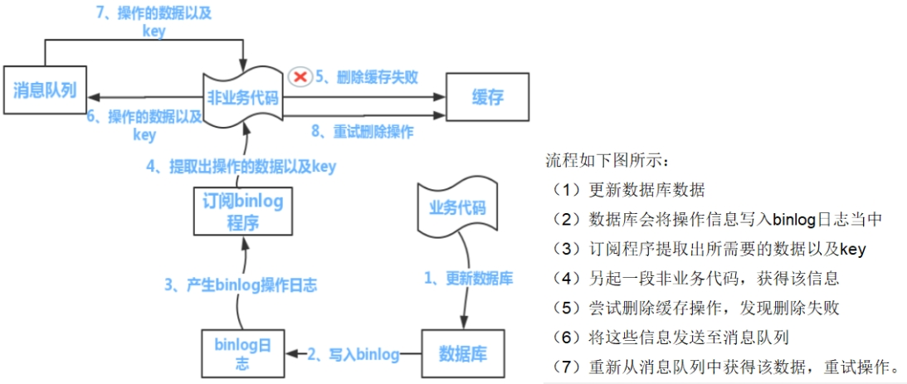

<br>

#### 总结

在大多数业务场景下，我们会把 Redis 作为只读缓存使用。假如定位是只读缓存来说，理论上我们既可以先删除缓存值再更新数据库，也可以先更新数据库再删除缓存，但是没有完美方案，两害相衡趋其轻的原则。优先**使用先更新数据库，再删除缓存的方案**。理由如下：

- 先删除缓存值再更新数据库，有可能导致请求因缓存缺失而访问数据库，给数据库带来压力，严重导致打满 mysql。
- 如果业务应用中读取数据库和写缓存的时间不好估算，那么，延迟双删中的等待时间就不好设置。

如果**使用先更新数据库，再删除缓存的方案**：如果业务层要求必须读取一致性的数据，那么我们就需要在更新数据库时，先在 Redis 缓存客户端暂存并发读请求，等数据库更新完、缓存值删除后，再读取数据，从而保证数据一致性。

<table>
  <tr>
    <td>操作顺序</td>
    <td>是否并发请求</td>
    <td>潜在问题</td>
    <td>现象</td>
    <td>应对方案</td>
  </tr>
  <tr>
    <td rowspan="2">先删缓存再更新数据库</td>
    <td>无</td>
    <td>缓存删除成功，但数据库更新失败</td>
    <td>应用从数据库读到旧数据</td>
    <td>重试数据库更新</td>
  </tr>
  <tr>
    <td>有</td>
    <td>缓存删除后，尚未更新数据库，有并发读请求</td>
    <td>并发请求从数据库读到旧值，并且更新到缓存，导致后续请求都读取旧值</td>
    <td>延迟双删</td>
  </tr>
  <tr>
    <td rowspan="2">先更新数据库，再删除缓存</td>
    <td>无</td>
    <td>数据库更新成功，但缓存删除失败</td>
    <td>应用从缓存读到旧数据</td>
    <td>重试缓存删除</td>
  </tr>
  <tr>
    <td>有</td>
    <td>数据库更新成功后，尚未删除缓存，有并发读请求</td>
    <td>并发请求从缓存中读到旧值</td>
    <td>等待缓存删除完成，期间会有不一致数据短暂存在</td>
  </tr>
</table>

---

### Redis 真实案例

---

### Redis 高性能原理

#### NIO 模式

当用户进程发出 read 操作时，如果 kernel（内核） 中的数据还没有准备好，那么它并不会阻塞用户进程，而是立刻返回一个 error。从用户进程角度讲 ，它发起一个 read 操作后，并不需要等待，而是马上就得到了一个结果。用户进程判断结果是一个 error 时，它就知道数据还没有准备好，于是它可以再次发送 read 操作。一旦内核中的数据准备好了，并且又再次收到了用户进程的 system call，那么它马上就将数据拷贝到了用户内存，然后返回。

在非阻塞式 I/O 模型中，应用程序把一个套接口设置为非阻塞，就是告诉内核，当所请求的 I/O 操作无法完成时，不要将进程睡眠而是返回一个“错误”，应用程序基于 I/O 操作函数将不断的轮询数据是否已经准备好，如果没有准备好，继续轮询，直到数据准备好为止。

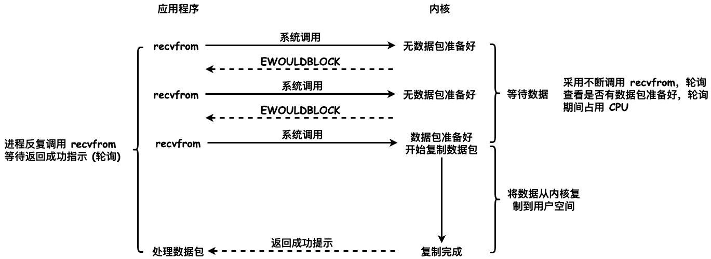

在 NIO 模式中，一切都是非阻塞的：

- accept() 方法是非阻塞的，如果没有客户端连接，就返回 error
- read() 方法是非阻塞的，如果 read() 方法读取不到数据就返回 error，如果读取到数据时只阻塞 read() 方法读数据的时间

在 NIO 模式中，只有一个线程：当一个客户端与服务端进行连接，这个 socket 就会加入到一个数组中，隔一段时间遍历一次，看这个 socket 的 read() 方法能否读到数据，这样一个线程就能处理多个客户端的连接和读取了。

NIO 成功的解决了 BIO 需要开启多线程的问题，NIO 中一个线程就能解决多个 socket，但是还存在 2 个问题：

- 这个模型在客户端少的时候十分好用，但是客户端如果很多，比如有 1 万个客户端进行连接，那么每次循环就要遍历 1 万个 socket，如果一万个 socket 中只有 10 个 socket 有数据，也会遍历一万个 socket，就会做很多无用功，每次遍历遇到 read 返回 -1 时仍然是一次浪费资源的系统调用。
- 遍历过程是在用户态进行的，用户态判断 socket 是否有数据还是调用内核的 read() 方法实现的，这就涉及到用户态和内核态的切换，每遍历一个就要切换一次，开销很大因为这些问题的存在。

NIO 的特点：

- 优点：不会阻塞在内核的等待数据过程，每次发起的 I/O 请求可以立即返回，不用阻塞等待，实时性较好。
- 缺点：轮询将会不断地询问内核，这将占用大量的 CPU 时间，系统资源利用率较低，所以一般 Web 服务器不使用这种 I/O 模型。

<br>

#### IO Multiplexing（IO多路复用）

IO multiplexing 就是我们说的 select、poll、epoll。有些地方也称这种 I/O 方式为 event driven I/O 事件驱动 IO。就是通过一种机制，一个进程可以监视多个描述符，一旦某个描述符就绪（一般是读就绪或者写就绪），能够通知程序进行相应的读写操作。可以基于一个阻塞对象，同时在多个描述符上等待就绪，而不是使用多个线程(每个文件描述符一个线程，每次 new 一个线程)，这样可以大大节省系统资源。所以 I/O 多路复用的特点是通过一种机制，使一个进程能同时等待多个文件描述符，而这些文件描述符（套接字描述符）其中的任意一个进入读就绪状态，select() 函数就可以返回。

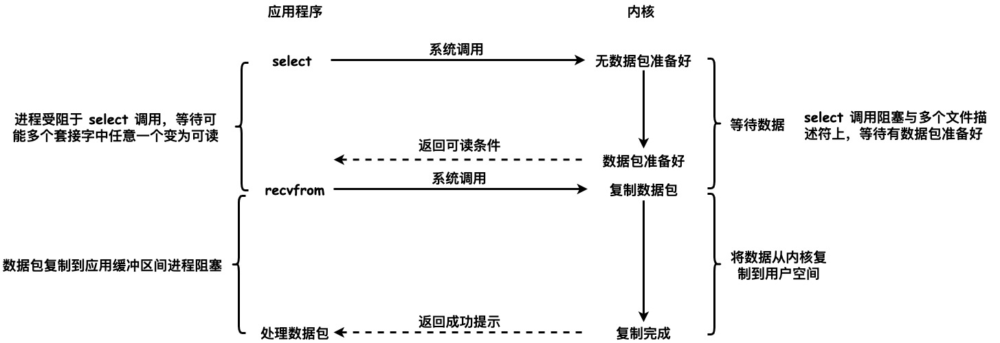

I/O multiplexing 这里面的 multiplexing 指的其实是在单个线程通过记录跟踪每一个 Sock(I/O流) 的状态来同时管理多个 I/O 流。目的是尽量多的提高服务器的吞吐能力。

文件描述符（File descriptor）是计算机科学中的一个术语，是一个用于表述指向文件的引用的抽象化概念。文件描述符在形式上是一个非负整数。实际上，它是一个索引值，指向内核为每一个进程所维护的该进程打开文件的记录表。当程序打开一个现有文件或者创建一个新文件时，内核向进程返回一个文件描述符。在程序设计中，一些涉及底层的程序编写往往会围绕着文件描述符展开。但是文件描述符这一概念往往只适用于UNIX、Linux这样的操作系统。

I/O 多路复用就是将用户 socket 对应的**文件描述符**注册进 epoll，然后 epoll 帮你监听哪些 socket 上有消息到达，这样就避免了大量的无用操作。此时的 socket 应该采用非阻塞模式。这样，整个过程只在调用 select、poll、epoll 这些调用的时候才会阻塞，收发客户消息是不会阻塞的，整个进程或者线程就被充分利用起来，这就是事件驱动，所谓的 reactor 反应模式。

<br>

#### Reactor 设计模式

基于 I/O 复用模型：多个连接共用一个阻塞对象，应用程序只需要在一个阻塞对象上等待，无需阻塞等待所有连接。当某条连接有新的数据可以处理时，操作系统通知应用程序，线程从阻塞状态返回，开始进行业务处理。

Reactor 模式，是指通过一个或多个输入同时传递给服务处理器的服务请求的事件驱动处理模式。服务端程序处理传入多路请求，并将它们同步分派给请求对应的处理线程，Reactor 模式也叫 Dispatcher 模式。即 I/O 多路复用统一监听事件，收到事件后分发(Dispatch 给某进程)，是编写高性能网络服务器的必备技术。

Reactor 模式中有 2 个关键组成

- Reactor：Reactor 在一个单独的线程中运行，负责监听和分发事件，分发给适当的处理程序来对 I/O 事件做出反应。 它就像公司的电话接线员，它接听来自客户的电话并将线路转移到适当的联系人；
- Handlers：处理程序执行 I/O 事件要完成的实际事件，类似于客户想要与之交谈的公司中的实际办理人。Reactor 通过调度适当的处理程序来响应 I/O 事件，处理程序执行非阻塞操作。

<br>

#### Redis 的 I/O 多路复用

Redis 利用 epoll 来实现 IO 多路复用，将连接信息和事件放到队列中，依次发放到文件事件分派器，事件分派器将事件分发给事件处理器。

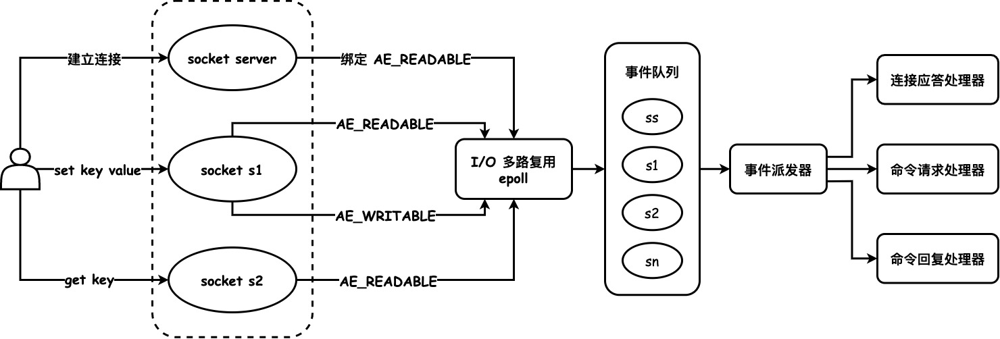

Redis 是跑在单线程中的，所有的操作都是按照顺序线性执行的，但是由于读写操作等待用户输入或输出都是阻塞的，所以 I/O 操作在一般情况下往往不能直接返回，这会因为某一文件的 I/O 阻塞而导致整个进程无法对其它客户提供服务，而 I/O 多路复用就是为了解决这个问题而出现的。

所谓 I/O 多路复用机制，就是说通过一种机制，可以监视多个描述符，一旦某个描述符就绪（一般是读就绪或写就绪），能够通知程序进行相应的读写操作。这种机制的使用需要 select 、 poll 、 epoll 来配合。多个连接共用一个阻塞对象，应用程序只需要在一个阻塞对象上等待，无需阻塞等待所有连接。当某条连接有新的数据可以处理时，操作系统通知应用程序，线程从阻塞状态返回，开始进行业务处理。

Redis 基于 Reactor 模式开发了网络事件处理器，这个处理器被称为文件事件处理器。它的组成结构为4部分：

1. 多个套接字

2. IO多路复用程序

3. 文件事件分派器

4. 事件处理器

> **因为文件事件分派器队列的消费是单线程的，所以 Redis 才叫单线程模型**。
>
> 文件事件处理器使用 I/O 多路复用(multiplexing)程序来同时监听多个套接字，并根据套接字目前执行的任务来为套接字关联不同的事件处理器。
>
> 当被监听的套接字准备好执行连接应答(accept)、读取 (read)、写入 (write)、关闭(close)等操作时，与操作相对应的文件事件就会产生， 这时文件事件处理器就会调用套接字之前关联好的事件处理器来处理这些事件。
>
> 虽然文件事件处理器以单线程方式运行，但通过使用 I/O 多路复用程序来监听多个套接字，文件事件处理器既实现了高性能的网络通信模型，又可以很好地与 Redis 服务器中其他同样以单线程方式运行的模块进行对接，这保持了 Redis 内部单线程设计的简单性。即文件事件分派器队列的消费是单线程的，所以Redis才叫单线程模型。
>
> 多路：多个客户端连接（连接就是套接字描述符，即 socket 或者 channel）。
>
> 复用：复用一个或几个线程。也就是说一个或一组线程处理多个 TCP 连接，使用单进程就能够实现同时处理多个客户端的连接。即一个服务端进程可以同时处理多个套接字描述符。

<br>

#### I/O多路复用的具体的实现

select、poll、epoll 都是 I/O 多路复用的具体的实现。

所谓 I/O 多路复用机制指内核一旦发现进程指定的一个或者多个 I/O 条件准备读取，它就通知该进程，就是说通过一种机制，可以监视多个描述符，一旦某个描述符就绪（一般是读就绪或写就绪），能够通知程序进行相应的读写操作。这种机制的使用需要 select、 poll、epoll 来配合。

多个连接共用一个阻塞对象，应用程序只需要在一个阻塞对象上等待，无需阻塞等待所有连接。当某条连接有新的数据可以处理时，操作系统通知应用程序，线程从阻塞状态返回，开始进行业务处理。

<br>

##### select

```c
# Linux 官网或 man 源码 （https://man7.org/linux/man-pages/man2/select.2.html）
int select(int nfds, 	/* 监控的文件描述符集例最大文件描述符加 1 */
           fd_set *restrict readfds, /* readfds：监控有读数据到达文件描述符集合，传入传出参数 */
           fd_set *restrict writefds, /* writefds：监控写数据到达文件描述符集合，传入传出参数 */
           fd_set *restrict exceptfds, /* exceptfds：监控异常发生到达文件描述符集合，传入传出参数 */
           struct timeval *restrict timeout); /* 定时阻塞监控时间，3种情况：
           										 1.NUll：永远等待下去
           										 2.设置 timeval，等待固定时间
           										 3.设置 timeval 里时间均为 0，检查描述字后立即返回，轮询 */
```

select 函数监视的文件描述符分 3 类，分别是 readfds、writefds 和 exceptfds，将用户传入的数组拷贝到内核空间，调用后 select 函数会阻塞，直到有描述符就绪（有数据可读、可写、或者有异常）或超时（timeout 指定等待时间，如果立即返回设为 null 即可），函数返回。当 select 函数返回后，可以通过遍历 fdset，来找到就绪的描述符。

分析 select 函数的执行流程： 

1. select 是一个阻塞函数，当没有数据时，会一直阻塞在 select  那一行；

2. 当有数据时会将 rset 中对应的那一位置设置为 1 ；

3. select 函数返回，不再阻塞 ；

4. 遍历文件描述符数组，判断哪个**文件描述符**被置位了；

5. 读取数据，然后处理。

select 函数的缺点 

1. bitmap 默认大小为 1024，虽然可以调整但还是有限度的 

2. rset 每次循环都必须重新置位为 0，不可重复使用 

3. 尽管将 rset 从用户态拷贝到内核态，由内核态判断是否有数据，但是还是有拷贝的开销 

4. 当有数据时 select 就会返回，但是 select 函数并不知道哪个**文件描述符**有数据了，后面还需要再次对文件描述符数组进行遍历，效率比较低 。

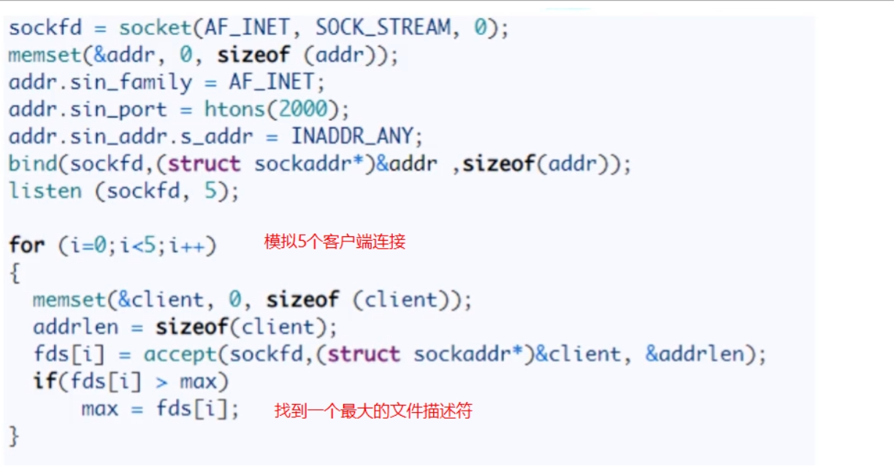

从代码中可以看出，select 系统调用后，返回了一个置位后的 &rset，这样用户态只需进行很简单的二进制比较，就能很快知道哪些 socket 需要 read 数据，有效提高了效率

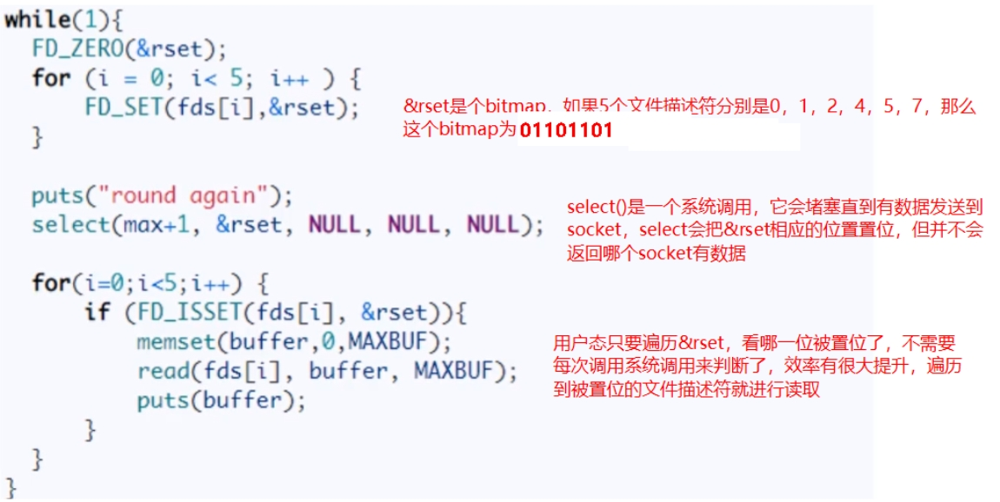

**select 的优点**：select 其实就是把 NIO 中用户态要遍历的文件描述符数组(我们的每一个 socket 链接，安装进 ArrayList 里面的那个)拷贝到了内核态，让内核态来遍历，因为用户态判断 socket 是否有数据还是要调用内核态的，所有拷贝到内核态后，这样遍历判断的时候就不用一直用户态和内核态频繁切换了。

**select 存在的问题**：

1. bitmap 最大 1024 位，一个进程最多只能处理 1024 个客户端
2. &rset 不可重用，每次 socket 有数据就相应的位会被置位
3. 文件描述符数组拷贝到了内核态(只不过无系统调用切换上下文的开销。（内核层可优化为异步事件通知）)，仍然有开销。select 调用需要传入 fd 数组，需要拷贝一份到内核，高并发场景下这样的拷贝消耗的资源是惊人的。（可优化为不复制）
4. select 并没有通知用户态哪一个 socket 有数据，仍然需要 O(n) 的遍历。select 仅仅返回可读文件描述符的个数，具体哪个可读还是要用户自己遍历。

> 综上，select 方式的小总结，既做到了一个线程处理多个客户端连接（文件描述符），又减少了系统调用的开销（多个文件描述符只有一次 select 的系统调用 + N次就绪状态的文件描述符的 read 系统调用。

<br>

##### poll

```c
# Linux 官网或 man 源码 （https://man7.org/linux/man-pages/man2/poll.2.html）
int poll(struct pollfd *fds, nfds_t nfds, int timeout);

struct pollfd {
    int   fd;         /* file descriptor */
    short events;     /* requested events */
    short revents;    /* returned events */
};
```

poll的执行流程：

1. 将五个 fd 从用户态拷贝到内核态 

2.  poll 为阻塞方法，执行 poll 方法，如果有数据会将 fd 对应的 revents 置为 POLLIN 

3. poll 方法返回 

4. 循环遍历，查找哪个 fd 被置位为 POLLIN了 

5. 将 revents 重置为 0 便于复用

6. 对置位的 fd 进行读取和处理

poll 解决的问题： 

1. 解决了 bitmap 大小限制 

2. 解决了 rset 不可重用的情况

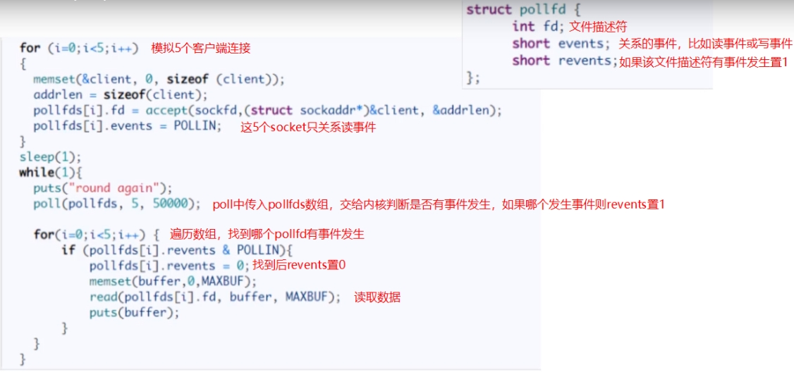

poll 的优点：

1. poll 使用 pollfd 数组来代替 select 中的 bitmap，数组没有 1024 的限制，可以一次管理更多的 client。它和 select 的主要区别就是，去掉了 select 只能监听 1024 个文件描述符的限制。
2. 当 pollfds 数组中有事件发生，相应的 revents 置位为 1，遍历的时候又置位回零，实现了pollfd 数组的重用。

poll 解决了 select 缺点中的前两条，其本质原理还是 select 的方法，还存在 select 中原来的问题

1. pollfds 数组拷贝到了内核态，仍然有开销
2. poll 并没有通知用户态哪一个 socket 有数据，仍然需要 O(n) 的遍历

<br>

##### epoll

Linux 官网或 man 源码 （https://man7.org/linux/man-pages/man7/epoll.7.html）

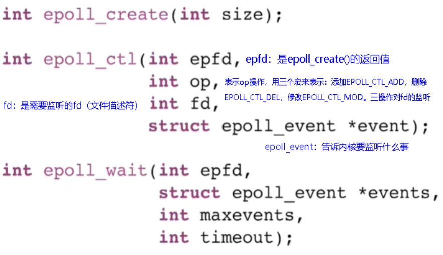

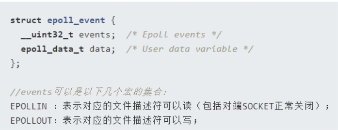

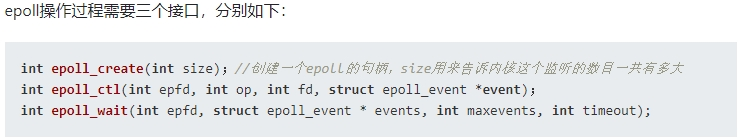

| int epoll_create(int size)                                   | 参数size并不是限制了epoll所能监听的描述符最大个数，只是对内核初始分配内部数据结构的一个建议 |
| ------------------------------------------------------------ | ------------------------------------------------------------ |
| int epoll_ctl(int epfd, int op, int fd, struct epoll_event *event) | 见上图                                                       |
| int epoll_wait(int epfd, struct epoll_event * events, int maxevents, int timeout) | 等待epfd上的io事件，最多返回maxevents个事件。参数events用来从内核得到事件的集合，maxevents告之内核这个events有多大。 |

<br>

epoll 的三部调用

1. epoll_create：`int epoll_create(int size)`，创建一个 epoll 句柄
2. epoll_ctl：`int epoll_ctl( int epfd,int op,int fd,struct epoll_event *event)`，向内核添加、修改或删除要监控的文件描述符
3. epoll_wait：`int epoll_wait(int epfd,struct epoll_event *event,int max events,int timeout)`，类似发起了 select() 调用 

epoll的执行流程： 

1. 当有数据的时候，会把相应的文件描述符“置位”，但是 epoll 没有 revent 标志位，所以并不是真正的置位。这时候会把有数据的文件描述符放到队首；

2. epoll 会返回有数据的文件描述符的个数；

3. 根据返回的个数 读取前 N 个文件描述符即可；

4. 读取、处理。

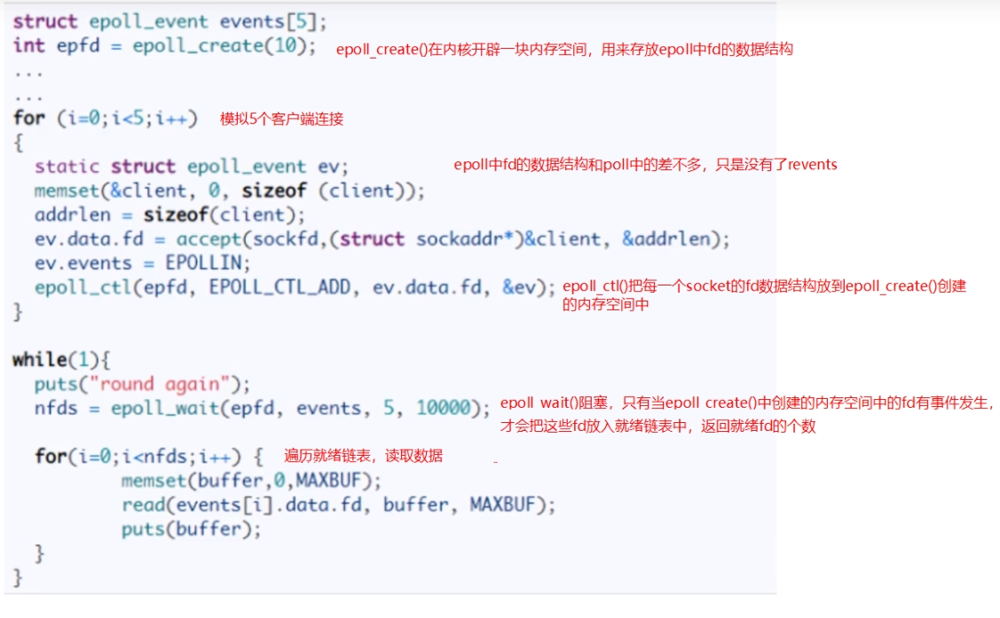

epoll 的时间通知机制：

1. 当有网卡上有数据到达了，首先会放到 DMA中（内存中的一个 buffer，网卡可以直接访问这个数据区域）
2. 网卡向 cpu 发起中断，让 cpu 先处理网卡的事
3. 中断号在内存中会绑定一个回调，哪个 socket 中有数据，回调函数就把哪个 socket 放入就绪链表中

<br>

epoll 的总结

多路复用快的原因在于，操作系统提供了这样的系统调用，使得原来的 while 循环里多次系统调用，变成了一次系统调用 + 内核层遍历这些文件描述符。

epoll 是现在最先进的 I/O 多路复用器，Redis、Nginx，linux 中的 Java NIO 都使用的是 epoll。

这里“多路”指的是多个网络连接，“复用”指的是复用同一个线程。

1. 一个 socket 的生命周期中只有一次从用户态拷贝到内核态的过程，开销小

2. 使用 event 事件通知机制，每次 socket 中有数据会主动通知内核，并加入到就绪链表中，不需要遍历所有的 socket

在多路复用 I/O 模型中，会有一个内核线程不断地去轮询多个 socket 的状态，只有当真正读写事件发送时，才真正调用实际的 I/O 读写操作。因为在多路复用 I/O 模型中，只需要使用一个线程就可以管理多个 socket，系统不需要建立新的进程或者线程，也不必维护这些线程和进程，并且只有真正有读写事件进行时，才会使用 I/O 资源，所以它大大减少来资源占用。多路 I/O 复用模型是利用 select、poll、epoll 可以同时监察多个流的 I/O 事件的能力，在空闲的时候，会把当前线程阻塞掉，当有一个或多个流有 I/O 事件时，就从阻塞态中唤醒，于是程序就会轮询一遍所有的流（epoll 是只轮询那些真正发出了事件的流），并且只依次顺序的处理就绪的流，这种做法就避免了大量的无用操作。 采用多路 I/O 复用技术可以让单个线程高效的处理多个连接请求（尽量减少网络 I/O 的时间消耗），且 Redis 在内存中操作数据的速度非常快，也就是说内存内的操作不会成为影响 Redis 性能的瓶颈。

<br>

##### select、poll、epoll 的总结

|                        | select                                           | poll                                             | epoll                                                        |
| :--------------------- | :----------------------------------------------- | :----------------------------------------------- | :----------------------------------------------------------- |
| 操作方式               | 遍历                                             | 遍历                                             | 回调                                                         |
| 数据结构               | bitmap                                           | 数组                                             | 红黑树                                                       |
| 最大链接数量           | 1024（x86）或 2048（x64）                        | 无上限                                           | 无上限                                                       |
| 最大支持文件描述符数量 | 一般有最大值限制                                 | 65535                                            | 65535                                                        |
| fd 拷贝                | 每次调用时，都需要把 fd 集合从用户态拷贝到内核态 | 每次调用时，都需要把 fd 集合从用户态拷贝到内核态 | fd 首次调用 epoll_ctl 时需要拷贝，但每次调用 epoll_wait 时不需要拷贝 |
| 工作效率               | 每次调用都进行线性遍历，时间复杂度为 O(n)        | 每次调用都进行线性遍历，时间复杂度为 O(n)        | 事件通知方式，每当 fd 就绪，系统注册的回调函数就会被调用，将就绪的 fd 放到 readList 里面，时间复杂度为 O(1) |

<br>

#### 五种 I/O 模型的总结

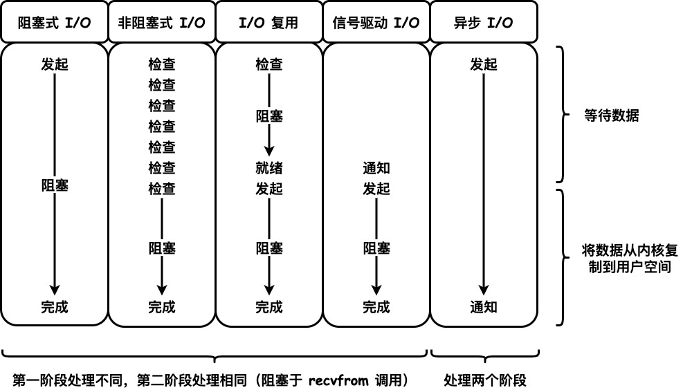

<br>

#### Redis 对于 /IO 多路复用函数的选择

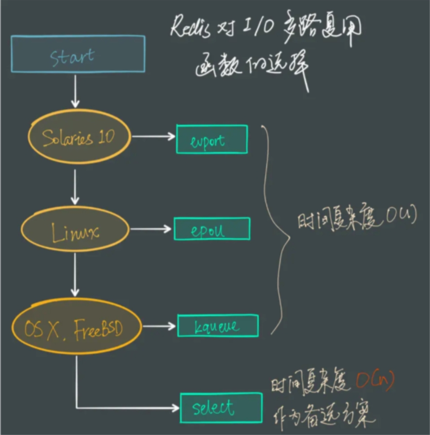

**Redis 保有三种 /IO 多路复用函数，select 作为保底方案**